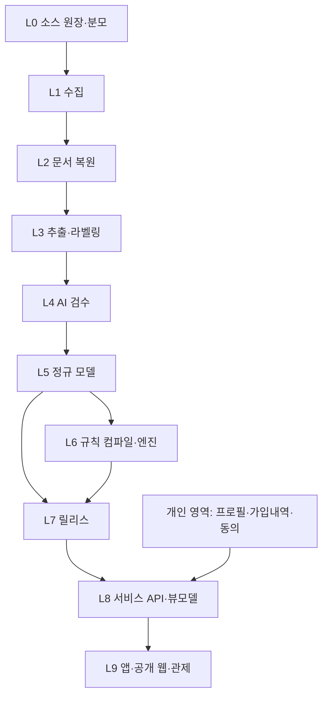

# 온전 설계도 (Blueprint) v1.0

2026-10-09 | 상태: 채택(ADR-0011) | 이 문서가 구현의 단일 기준이다.

## 0. 이 문서의 역할

구현이 산으로 가지 않게 하는 기준선이다. 무엇을 왜 만들고, 무엇을 만들지 않으며, 어떤 순서와 관문으로 만드는지를 한곳에 고정한다.

### 0.1 문서 위계

| 순위 | 문서 | 역할 |
|---|---|---|
| 1 | `docs/PRINCIPLES.md` | 불변 원칙. 바꾸려면 ADR과 제품 책임자 승인 |
| 2 | **이 문서** | 목적, 범위, 계층, 공유 계약, 불변식, 순서, 관문 |
| 3 | `docs/decisions/` 중 이 문서 이후의 ADR | 이 문서를 바꾸는 유일한 경로 |
| 4 | 계약 문서 | `docs/data/*`, `docs/design/CONSUMER_FLOW_SPEC.md`, 각 상세 부록 |
| 5 | 배경 문서 | 마스터플랜 v0.3, 제3부, 평가서. 근거와 상세 논의 |

아래 순위 문서가 위 순위와 충돌하면 위를 따르고, 아래 문서를 고치는 PR을 낸다. 사용자의 명시적 최신 결정은 문서보다 우선한다. 구현자가 임의로 결정을 바꾸지 않으며, 사용자 결정과 설계 변경은 ADR 및 이 문서 §7에 반영해 추적한다.

### 0.2 이 문서에 쓰는 기호

- **A** 정보 비대칭(§1), **Q** 소비자 질문(§3), **L** 시스템 계층(§4), **I** 설계 불변식(§8), **M** 마일스톤(§9).
- 모든 PR은 자신이 어느 A·Q·L·I·M에 해당하는지 밝힌다(§10).

---

## 1. 북극성: 보험상품시장의 정보 비대칭 해소

판매하는 쪽은 알고 사는 쪽은 모르는 것을 소비자 쪽으로 옮긴다. 온전은 공개돼 있지만 흩어지고 읽기 어려운 보험 정보를 모아, 소비자가 판매자의 설명 없이도 확인하고 판단하게 한다.

| ID | 비대칭 | 판매 쪽이 아는 것 | 소비자가 보통 아는 것 | 온전의 해소 수단 | 측정 |
|---|---|---|---|---|---|
| A1 | 보장 내용 | 약관 전체와 정의 | 상품명, 요약 문구 | 원문 수집, 라벨링, 근거가 연결된 쉬운 설명 | 핵심 보장을 맞게 설명한 비율 |
| A2 | 지급 제한 | 면책·감액·제외·한도·종료 | 거의 모름 | 불리 조건 라벨, 보장과 같은 자리에 표시 | 제한 조건을 스스로 찾은 비율 |
| A3 | 상품 간 차이 | 같은 이름, 다른 정의 | 이름이 같으면 같다고 여김 | 동일 비교축의 담보 비교 | 차이를 정확히 짚은 비율 |
| A4 | 가격과 그 조건 | 가격이 어떤 조건의 값인지 | 숫자 하나 | 가격을 조건·특약 구성·기준일과 함께 수집·표시 | 공개 가격과 개인 가격을 구별한 비율 |
| A5 | 내 계약의 실제 의미 | 내 계약 담보의 작동 방식 | 증권의 담보명 | 가입내역 PDF → 계약 트윈 → 만약에 | 내 계약의 지급 조건을 설명한 비율 |
| A6 | 변경의 득실 | 갈아타거나 더할 때 잃는 것 | 새로 얻는 것만 들음 | 두 안 비교: 추가·줄어드는 것·그대로·비용과 미확인 | 줄어드는 것을 하나 이상 말한 비율 |
| A7 | 판매 설명의 검증(후속) | 제안서가 무엇을 뺐는지 | 설명을 믿을 수밖에 없음 | 받은 제안서와 원문 대조 | 스켈레톤 |

규칙: **A1~A7 중 하나에 연결되지 않는 기능은 만들지 않는다.**

반대 규칙: **새로운 비대칭을 만들지 않는다.** 근거 없는 점수, 0원으로 둔갑한 미확인, 추정 가격처럼 확실해 보이는 불확실은 소비자를 다시 모르는 쪽에 둔다. 그래서 §2와 §8이 있다.

## 2. 하지 않을 것

| 하지 않을 것 | 이유 |
|---|---|
| 첫 출시의 상품 판매·중개·가입 대행·리드 판매 | 상담·사업 기능은 후속 검토 범위이며 영구 폐지 결정으로 확대하지 않음 |
| 광고비·수수료·전환율이 순위·추천·노출에 영향 | 불변 원칙 1 |
| 건강 점수, 보장 점수, 근거 없는 충족률·채움 게이지 | 확실해 보이는 가짜 정보 |
| 미확인을 0원·없음·거짓으로 처리 | 불변 원칙 3 |
| 가격의 연령 보간, 가입금액 비례 환산, 다른 비교 기준 가격 합산 | 가격 비대칭을 숨김 |
| AI 자유 문장이 금액·지급 여부를 결정 | 불변 원칙 7 |
| 개인 인수 결과·실견적 흉내 | 공개 정보로 알 수 없는 것 |
| 건강정보의 광고·설계사 순위 활용, DNA 파생정보의 보험사·설계사 전달 | 불변 원칙 8. 별도 동의·조건 검토가 필요한 외부 AI 처리는 별도 경계 |
| "전문가 검수" 표기 | 사람 검수가 없다(ADR-0006) |
| 특정 보험사에 대한 평가어 | 사실만 보여준다 |

## 3. 소비자 질문, 화면, 데이터

| ID | 소비자 질문 | 비대칭 | 주 화면 | 필요한 계약 객체 |
|---|---|---|---|---|
| Q1 | 이 담보는 무엇을 보장하나? | A1 | 담보 상세, 홈 | CoverageOccurrence, FieldAssertion, 설명 템플릿 |
| Q2 | 언제 못 받나? | A2 | 담보 상세 | FieldAssertion(제약 축), 불리 조건 라벨 |
| Q3 | 다른 상품과 무엇이 다른가? | A3 | 같은 담보 비교 | 비교축, CoverageOccurrence 여럿 |
| Q4 | 얼마이고, 어떤 조건의 가격인가? | A4 | 내 설계, 상품 행 | PremiumObservation, 비교 기준 |
| Q5 | 내 계약은 실제로 무엇을 하나? | A5 | 홈, 계약 상세, 만약에 | PersonalPolicy, Rule, EvaluationResult |
| Q6 | 바꾸면 무엇을 얻고 잃나? | A6 | 내 설계, 두 안 비교 | PlanView, 차이 항목 |
| Q7 | 이 숫자는 어디서 왔나? | 전체 | 증거 보기 | 근거 사슬(§5.2) |

내 설계 탭의 시각 기준은 `docs/design/assets/selected-my-plan.png`다(ADR-0010). 동작은 `CONSUMER_FLOW_SPEC.md`, 치수·조작 세부는 `화면_조작_설계서.md`가 정한다.

## 4. 시스템 계층



| 계층 | 책임 | 출력 계약 | 금지 | 상태 |
|---|---|---|---|---|
| L0 | 어디서 무엇을 모아야 하는지 안다 | SourceRegistry, DiscoveryManifest, ExpectedDocument, ExpectedPrice | 분모 없이 "전수" 주장 | 설계 |
| L1 | 원문을 받아 그대로 보존 | RawAsset(바이트 해시, 관측 이력) | 인증·차단 우회, 원문 덮어쓰기 | 설계 |
| L2 | 원문 구조 복원 | ClauseOccurrence(페이지·좌표·정확 인용·표 셀) | 좌표·문장 지어내기, 임의 길이 자르기 | 설계 |
| L3 | 필드 후보 추출 | FieldAssertion, PremiumObservation 후보 | 빈칸을 상식으로 채우기, 문서 속 지시 실행 | 설계 |
| L4 | 승인 또는 보류 | ReviewDecision(계열이 다른 에이전트, 코드 검사, 레드팀) | 다수결, 자기 확신 점수로 승인 | 설계 |
| L5 | 상품·담보·가격의 정규 모델 | ProductVersion, CoverageOccurrence, RiderOccurrence, 관계 그래프 | 이름 유사도로 버전 병합 | 설계 |
| L6 | 승인된 의미를 실행 규칙으로 | Rule(DSL), EvaluationResult | 부동소수점, 허용 목록 밖 연산, 미확인을 0으로 | **구현(합성 규칙 범위)** |
| L7 | 불변 공개본 | ReleaseManifest | 검증 안 된 변경 배포, 공개본 수정 | 설계 |
| L8 | 화면이 받는 유일한 형식 | PlanView, CoverageDetail, CompareView, EvidenceView | 화면 쪽 계산 | 설계 |
| L9 | 보여주고 조작 | Flutter 앱, 공개 웹 `/coverage`, 관제 콘솔 | 데이터 상태를 넘는 표현 | 설계 |

의존 방향은 위에서 아래뿐이다. 앱은 L8만 본다. 계산은 L6만 한다(ADR-0003). 개인 영역은 공개 데이터 영역(L0~L7)과 저장·권한·로그가 분리된다.

**디지털 트윈의 정의:** L5의 상품 모델과 개인 영역의 계약 모델을 L6 규칙으로 실행해, 사용자가 고른 가정에서 무엇이 지급되고 무엇이 막히는지 재현하는 것. 보험사의 인수·지급 결정을 복제한다는 뜻이 아니다.

## 5. 데이터 척추

### 5.1 공유 계약 객체

| 객체 | 핵심 필드 | 소유 계층 | 상세 문서 |
|---|---|---|---|
| SourceRegistry / DiscoveryManifest | 소스, 조회 조합, 종료 증거, 차단 구간 | L0 | DATA_PIPELINE_CONTRACT §1 |
| ExpectedDocument / ExpectedPrice | 기대 문서·가격 지점, 발견 상태, 누락 사유 | L0 | 위와 가격 수집 명세 §4.4 |
| RawAsset | 바이트 해시(=보관 키), URL, 관측 시각, 응답 증거. R2 원본 버킷, 덮어쓰기 없음 | L1 | 제2부 §24, DATA_PIPELINE_CONTRACT §3.1, ADR-0015·0016 |
| SourceObservation | 한 번의 수집: URL, 시각, 받은 바이트의 해시·크기·형식, 변경 감지 결과 | L0~L1 | DATA_PIPELINE_CONTRACT §3.1 |
| DerivedOutput | 원본 해시별 추출·OCR 결과와 도구·버전. 원본과 다른 버킷 | L2 | DATA_PIPELINE_CONTRACT §3.1 |
| ClauseOccurrence | 문서 버전, 조항 경로, 페이지, 좌표, 정확 인용 | L2 | DATA_PIPELINE_CONTRACT §3 |
| FieldAssertion | raw·정규화 값, 단위, value_state, 근거, 적용 범위, 추출·검증 이력 | L3~L4 | 제2부 §29 |
| PremiumObservation | 금액, 가격 근거, 조건과 조건 출처, 특약 구성·묶음, 기준일, 비교 기준 | L3~L5 | PREMIUM_DATA_CONTRACT, 가격 수집 명세 |
| CodeSet | 코드 체계, 개정차수, 고시·시행일, 판정 시점 규칙 | L3~L5 | DATA_PIPELINE_CONTRACT §4 |
| ParameterTable | 약관이 밖으로 위임한 값의 공시 표: 키 구간, 열린 구간 관측 시각, 원문 해시 | L3~L5 | DATA_PIPELINE_CONTRACT §4 |
| ProductVersion / CoverageOccurrence | 회사, 채널, 판매 기간, 문서 묶음, 담보 발생본 | L5 | 제2부 §27 |
| Rule | rule_id, rule_version, release_id, 내용 해시, 근거, DSL | L6 | 엔진 README, 제3부 §49 |
| EvaluationResult | 지급 판정, 금액, 누락 입력, trace, 규칙 식별 정보 | L6 | 엔진 코드 |
| ReleaseManifest | 원문 해시, 스키마·사전·모델·프롬프트·엔진·규칙 버전 | L7 | DATA_PIPELINE_CONTRACT §7 |
| PersonalPolicy / Profile / Consent | 가입내역 상태, 확인 여부, 민감도 | 개인 영역 | 제3부 §46~47 |
| PlanView 등 뷰모델 | plan_id, input_hash, release_id, plan_action, unresolved_items | L8 | 화면 설계서 §11 |

### 5.2 근거 사슬

화면의 모든 숫자와 사실 문장은 끝까지 따라갈 수 있어야 한다.

```text
화면의 숫자·문장
 → 뷰모델 (release_id, input_hash)
 → EvaluationResult (rule_id, rule_version, rule_content_hash, evidence_refs, trace)
 → Rule (DSL, evidence_refs)
 → FieldAssertion (값, 상태, 검수 결정)
 → ClauseOccurrence (페이지, 좌표, 정확 인용)
 → RawAsset (바이트 해시)
 → SourceRegistry (URL, 관측 시각)
```

가격은 PremiumObservation → RawAsset 경로로 같은 방식이다. 사슬이 한 칸이라도 끊긴 정보는 화면에 사실로 나가지 않는다(I6).

설명·조건 비교·가격 비교·계산 자격은 별도 capability다. 아래 이용 등급이 높다는 이유로 다른 기능을 자동 활성화하지 않는다(ADR-0012). 검증된 설명은 계산 불가 상품에도 제공한다.

## 6. 공유 어휘 (enum 레지스트리)

상태값의 정본은 [`packages/schemas/vocabulary.json`](../packages/schemas/vocabulary.json)이다. 사람이 읽는 표는 [`docs/blueprint/VOCABULARY.md`](blueprint/VOCABULARY.md)이며 같은 파일에서 생성된다. 코드는 M1에서 같은 정본으로 생성한다. 새 값은 정본에 먼저 추가한다. `tools/vocab_check.py`가 CI에서 정본의 무결성, 생성 문서의 최신성, 계약 문서의 폐기된 이름을 검사한다.

축은 서로 섞지 않는다. 핵심 구분은 다음과 같다.

| 축 | 질문 | 예 |
|---|---|---|
| `acquisition_status` | 분모의 이 항목을 확보했나, 못 했다면 왜인가 | unqueried, blocked, failed, not_found, not_disclosed, archived |
| `pipeline_stage` + `pipeline_block` | 어디까지 처리했고 무엇이 막았나 | discovered … released / none, hold, failed |
| `value_state` | 이 값에 대해 무엇을 아나 | observed, derived, not_found, unreadable, conflicting, not_applicable, not_disclosed |
| `review_status` | AI 검수 결과는 무엇인가 | pending, accepted, hold, rejected |
| `capability` + `capability_state` | 무엇을 해도 되나(설명·조건 비교·가격 비교·계산은 독립) | search, explain, compare_conditions, compare_price, simulate |
| `display_status` | 화면에 무엇이라 보이나(파생, 저장 안 함) | confirmed, input_missing, data_missing, under_review, hold, not_applicable |
| `plan_action` / `row_label` | 사용자가 초안에서 무엇을 하려나 / 행에 무엇이 보이나 | keep, add, remove, modify / needs_condition |
| `price_basis` / `price_unavailable_reason` / `freshness` | 가격의 근거, 없는 이유, 최신성 | illustrative … / condition_mismatch … / fresh, stale |
| `policy_holdings_status` / `contract_version_match` | 내 가입내역을 얼마나 아나 / 어느 버전인가 | confirmed, pending_confirmation, none_declared, unknown, skipped / matched, ambiguous, unmatched |
| `clause_path_basis` / `relation_type` / `amount_form` | 조항 번호를 읽었나 추정했나 / 간선의 종류 / 원문이 금액을 적은 형식 | printed, inferred / attached_to, routes_to, parameter_from … / example_amount, per_unit_krw … |

전체 31개 축과 화면 문구, 폐기된 표기의 대응은 VOCABULARY.md에 있다. 제3부 §44.3·§56, 화면 설계서 §6의 이전 표기는 이 정본으로 대체된다.

## 7. 현행 결정 요약

### 7.1 범위

| 구분 | 내용 | 근거 |
|---|---|---|
| 대상 | 국내 모든 보험사의 모든 보험, 모든 특약, 판매 중지 포함 | ADR-0004 |
| 첫 출시 | 소비자 앱(홈, 담보 상세, 같은 담보 비교, 만약에, 내 설계, 두 안 비교, 증거, 내 정보), 공개 웹, 관제 콘솔 | ADR-0008·0009·0010 |
| 첫 출시 데이터 | 금융당국·협회·보험사 공시 매일 크롤링, 라벨링, AI 검수, 디지털 트윈, 공개 가격 | ADR-0008·0010 |
| 첫 출시 개인 입력 | 가입내역 PDF(선택), 선택 가족력(본인 프로필만) | ADR-0005·0009 |
| 스켈레톤 | 상담 연결, 설계사 포털, 개인 견적, 설계 검증, 콘텐츠·광고·구독, 가족 초대 | ADR-0008·0009 |
| 제외 | DNA 구현(설계 동결), 촬영 입력, 통합조회·마이데이터, 체험판 웹, 소비자 웹앱, 푸시 알림 | ADR-0005·0007·0009 |

전 상품을 대상으로 하는 것과 모든 담보를 계산 가능하다고 보증하는 것은 별개다. 계산은 AI 검수를 통과한 담보부터 켜지고 나머지는 원문과 확인된 정보를 보여준다.

### 7.2 방식

| 주제 | 결정 | 근거 |
|---|---|---|
| 검수 | AI만. 계열이 다른 에이전트, 불일치는 보류 | ADR-0006 |
| 분모 조사 | AI 두 경로 대조·조회 증거·미탐색 공개. 통계로 누락 없음 판정 금지 | ADR-0006·0012 |
| 출시 | 한 번. 베타·단계 공개 없음 | ADR-0007 |
| 스택 | Rust(API·엔진·워커), Python(문서 복원·OCR 격리), Flutter, Next.js, PostgreSQL | ADR-0001 |
| 계산 | 서버의 규칙 엔진 하나 | ADR-0003 |
| 접근성 | 목표 아님 | 제3부 §51.4 |
| 판단 기준 | 소비자의 알 권리 | PRINCIPLES |

### 7.3 대체된 결정 (다시 살리지 않는다)

- ADR-0007의 "DNA를 제외한 전 기능 출시" → ADR-0008의 범위로 대체.
- ADR-0008의 가격·예산 없음, 가족력 제외, 기본 격자 지도, 시나리오 슬라이더로 예산 대체 → ADR-0009·0010으로 대체.
- 근거 없는 필요액·충족률·채움 게이지 → 폐기(ADR-0009).
- 가격 구간 추정·연령 보간 → 폐기(PREMIUM_DATA_CONTRACT).
- 사람 검수, 사람 정답셋 → AI 검수로 대체(ADR-0006).

## 8. 설계 불변식

검사 가능한 약속이다. 테스트나 정적 검사로 강제될 때만 "구현"으로 표시한다.

| ID | 불변식 | 강제 위치 | 상태 |
|---|---|---|---|
| I1 | 미확인은 0원·없음·거짓이 되지 않는다 | 엔진 골든·건전성 테스트 | 구현(엔진) |
| I2 | 계산 결과는 규칙 버전·릴리스·내용 해시·근거를 갖는다 | 엔진 `review_fixes` | 구현(엔진) |
| I3 | 로드된 규칙은 바뀌지 않고, 바꾸려면 재검증·재해시 | `compile_fail` 문서 테스트 | 구현(엔진) |
| I4 | 금액은 정수 원, 반올림은 명시 | 엔진 로더 | 구현(엔진) |
| I5 | 허용 목록 밖 연산은 로드되지 않는다 | 엔진 로더 | 구현(엔진) |
| I6 | 화면의 숫자·사실 문장은 근거 사슬(§5.2)을 끝까지 따라간다 | API 계약 테스트 | 미구현 |
| I7 | 가격은 조건·특약 구성·기준일·근거 없이 저장되지 않는다 | DB 제약, 테스트 | 미구현 |
| I8 | 다른 비교 기준·버전·묶음의 가격을 합산하지 않는다 | 뷰모델 테스트 | 미구현 |
| I9 | 보완안 비교는 줄어드는 것(면책·감액·제외 포함)을 항상 계산·표시 | 뷰모델 테스트 | 미구현 |
| I10 | 광고비·수수료 필드는 정렬·추천 코드의 입력이 아니다 | 정적 검사 | 미구현 |
| I11 | private_health·genetic_private는 로그·분석에 나가지 않는다. 외부 AI는 별도 동의·최소화·처리 조건 게이트, DNA의 보험사·설계사 전달은 금지 | 누출 테스트 | 미구현 |
| I12 | 공개 데이터와 개인 데이터는 저장·권한이 분리된다 | 스키마 | 미구현 |
| I13 | 원문 속 지시문은 실행되지 않는다(추출 워커에 권한 없음) | 워커 권한 설정, 테스트 | 미구현 |
| I14 | 에이전트 불일치는 다수결이 아니라 보류다 | 검수 정책 테스트 | 미구현 |
| I15 | 출시 문구에 "전문가 검수"가 없다 | 문구 린트 | 미구현 |
| I16 | 공개 릴리스는 불변이고 롤백은 manifest 교체다 | 릴리스 테스트 | 미구현 |
| I17 | 분모 근거 없이 "전수"라고 표시하지 않는다 | `/coverage` 생성 로직 | 미구현 |
| I18 | 같은 입력·릴리스·엔진이면 같은 결과다 | 엔진 재현성 테스트 | 구현(엔진) |

## 9. 구현 순서와 관문

### 9.1 순서를 이렇게 잡는 이유

지금까지 L6 엔진을 먼저 만들었다. 엔진은 디지털 트윈의 심장이지만, 엔진이 표현해야 할 것은 실제 약관이 정한다. 데이터 계층(L0~L5)이 없는 상태에서 엔진만 키우면 실제 문서와 맞지 않는 DSL을 다듬게 된다. 그래서 M1의 코드를 늘리기 전에 **V1 설계 확정**을 둔다. 상태값을 하나로 확정하고, 실제 조항·별표·가격표를 현재 데이터 구조에 넣어 표현력을 확인하고, 같은 자료가 선택한 화면에 어떻게 나타나는지 연결한다. 그다음 M2에서 같은 표본으로 모든 계층을 관통한다.

대상은 전 보험사·전 상품·전 특약이다(확정, ADR-0004·0013). 보험사·상품 선정은 사용자 결정도 작업 시작 조건도 아니다. 전체 수집 대상 목록을 먼저 만들고, 설계 검증용 표본은 구현자가 다양한 상품 구조와 문서 형식을 다루도록 직접 고른다. 표본 검증은 서비스 범위 축소가 아니며, 전체 대상의 수집·처리 여부와 미확보 사유는 표본과 상관없이 추적한다.

### 9.2 마일스톤

| ID | 내용 | 해소하는 비대칭 | 통과 관문 |
|---|---|---|---|
| M0 | 엔진 v0.1과 합성 규칙 | 기반 | 완료. I1~I5, I18 |
| V0 | 전체 수집 대상 목록(분모 최상위): 보험사 전부와 공시 진입점, 접근 결과, 미확보 사유 | 전체 | `data/registry/`에 증거와 함께 존재. 하위 상품·특약은 미열거 상태로 추적 |
| V1 | 설계 확정: (a) 상태 어휘 정본 (b) 실제 조항·별표·가격표로 표현력 검증 (c) 소비자 화면 연결 검증 | A1, A2, A4 | (a) `vocabulary.json`과 검사기 (b) 표본별 매핑과 부족분 목록, 부족분의 설계 반영 (c) 같은 자료로 "무엇을 보장하나·언제 못 받나·왜 이 가격인가"가 선택 화면에 나타남. **설계 탐색 완료(2026-10-09), 관문 미통과**: [validation/](blueprint/validation/README.md), 부족분 G01~G26. 보관소는 S3로 결정(ADR-0015), 원본 14건은 같은 배치의 임시 보관본으로 보존(원본 해시·인용 14/14, 파생 결과까지 완전 재현 8/14, 나머지 6건은 재생성 도구 없음으로 미검증). 남은 조건: S3 실제 보존과 다운로드 대조(자격 증명 필요), 다른 계열 AI 검수, 화면 열린 항목(S1·S6) |
| M1 | 데이터 척추: §6 어휘를 `packages/schemas`로 생성(Rust·Dart·TS), 공개/개인 분리 DB 스키마 초안 | 기반 | 어휘가 코드로 생성됨, I7·I12가 스키마 제약으로 존재 |
| M2 | 걸어가는 뼈대: V1 표본 문서들을 L1~L9까지 관통 | A1, A2, A4 | 화면 숫자 하나에서 원문 좌표까지 따라감(I6), 보류 경로가 실제로 작동, 그림자 비교 1회 |
| M3 | 분모와 수집 확장: AI 분모 조사, 어댑터 표준, 일일 스케줄, `/coverage` | A1~A3의 범위 | 분모 공개, 일일 확인 달성률 측정, I17 |
| M4 | 같은 담보 비교와 공개 가격 | A3, A4 | I7, I8, 비교 기준 동작 |
| M5 | 계약 트윈과 내 설계: PDF 가져오기, 두 안 비교, 만약에 | A5, A6 | I9, I11 |
| M6 | 상품군 확장(W1~W6), 실손 상환형 연산, 출시 게이트 | 전체 | 출시 게이트 전 항목, I10·I13~I16 |

각 마일스톤은 관문을 통과해야 다음으로 넘어간다. 관문에서 막히면 다음 단계로 건너뛰지 않고 원인을 고친다. 기간은 관문 통과로 관리하며 날짜를 약속하지 않는다.

### 9.3 M2 걸어가는 뼈대의 최소 구성

표본은 V1에서 구현자가 고른 다양한 구조·형식의 문서들이다. 아래는 표본마다 거치는 경로다.

1. 실제 공개 문서를 수집해 해시와 함께 불변 보관한다(L1).
2. 해당 담보 조항을 페이지·좌표·정확 인용과 함께 복원한다(L2).
3. 지급사유·금액 기준·면책·감액·제외 필드를 FieldAssertion으로 추출한다(L3).
4. 계열이 다른 두 에이전트와 코드 검사로 승인 또는 보류한다(L4).
5. 승인된 필드를 규칙 JSON으로 컴파일하고 엔진으로 평가한다(L5~L6).
6. 릴리스 manifest를 만든다(L7).
7. EvidenceView와 CoverageDetail 뷰모델을 낸다(L8).
8. 한 화면에서 숫자를 누르면 원문 하이라이트까지 간다(L9 최소판).

M2의 산출물이 DSL·라벨 사전·FieldAssertion 스키마의 첫 실증이다. 여기서 드러난 부족분이 이후 설계를 고친다.

V1-b가 실제 표본으로 미리 찾은 부족분은 [GAP_REPORT.md](blueprint/validation/GAP_REPORT.md)에 있다. 그에 따른 순서: M1은 CodeSet·ParameterTable·`value_kind`·`amount_form`을 스키마에 넣는다. M2는 V1 표본의 보류 항목(표 셀 좌표, 미발췌 조항)을 실제 파이프라인으로 해소한다. rule-0.2 연산(`multiply_count`, `subtract_floor0`, `pro_rata`, `divide_count`, `anniversary_band`, 목록 입력과 `max_over`, `contract_effect`)은 해당 상품군을 계산 범위에 넣는 마일스톤(M5·M6)에서 사례와 함께 추가한다. 코드 판정·시간 단위 판정·누적 사용량·외부 파라미터 조회는 DSL에 넣지 않고 입력 단계가 맡는다.

### 9.4 개발 구역과 레포 방향 (D15)

최종 방향은 네 레포(onjeon-data, onjeon-knowledge, onjeon-twin, onjeon-app)다. 다만 병렬 개발은 레포 분리를 기다리지 않는다. 지금 이 레포 안에서 구역과 공통 계약을 확정하고 구역별로 병렬 개발한다. 기존 폴더를 먼저 옮기지 않고, 구역별 책임과 허용 의존성부터 고정한다.

| 구역 | 책임 | 설계도 계층 |
|---|---|---|
| data | 공시 수집, 원본 보존, 추출, 변경 관측 | L0~L2 |
| knowledge | 개념·라벨·관계·근거 검수, 조항을 구조화된 조건과 규칙으로 표현, 지식 릴리스 | L3~L5, L7 |
| twin | 규칙 언어·컴파일러·실행기, 개인 계약 적용, 시뮬레이션 | L6 |
| app | 소비자 화면, 인증·동의, 개인 자료 처리 흐름(개인 보험증권 PDF의 비공개 처리 모듈 포함) | L8~L9, 개인 영역 |
| contracts | 공통 식별자·근거 참조·상태값·API·릴리스 호환 계약. 이 레포 안에서 정본 관리, 나중에 버전이 붙은 패키지로 배포(다섯 번째 레포는 만들지 않음) | 전 계층 |

경계 원칙:

1. knowledge가 "무슨 조건인가"를 정하고, twin이 "그 조건을 어떻게 정확하게 실행하는가"를 책임진다. knowledge가 내보내는 규칙도 twin의 컴파일러와 검증을 통과해야 한다. twin에서 약관을 다시 자유롭게 해석하지 않는다.
2. 개인 보험증권 PDF는 app의 비공개 처리 모듈이 받아 계약 구조로 바꾸고, twin에는 계산에 필요한 최소 입력만 넘긴다. 문서 추출 코드는 재사용할 수 있지만 공시 수집 작업과 개인 문서 처리 작업의 저장소·실행 계정·권한은 분리한다.
3. 계산할 수 없는 상품도 확인된 설명과 조건·가격은 knowledge 릴리스에서 app으로 바로 제공한다(twin을 거치지 않는다).
4. 데이터 접근 통제는 레포 공개 여부와 별개다. 실제 경계는 저장소(R2 등)·실행 계정·접근 권한으로 강제한다. 수집기 코드가 공개돼도 원본 버킷은 비공개이고, 레포를 나눈다고 개인정보가 자동으로 격리되지 않는다.
5. 계약 변경은 책임자와 호환성 검사로 관리한다. 어느 레포에 있느냐보다 이것이 중요하다.

분리 순서: data를 첫 분리 대상으로 준비하고, 독립 빌드·계약 패키지·통합 시험이 갖춰지면 분리한다. 나머지는 독립 배포, 버전 고정, 호환성 검사, 통합 재현이 가능해졌을 때 분리한다.

## 10. 드리프트 방지 규칙

1. 모든 PR은 템플릿(`.github/pull_request_template.md`)에 해당하는 A·Q·L·I·M을 적는다. 어디에도 연결되지 않으면 범위 밖이다.
2. 새 상태값·enum은 §6에 먼저 추가하는 PR을 낸 뒤 쓴다.
3. 결정 변경은 ADR → §7 갱신 순서다. 대화에서 바뀐 방향도 ADR로 남긴다.
4. 불변식은 테스트로 강제될 때만 "구현"이다.
5. 같은 주제의 명세는 하나다. 부록은 상위 명세와 충돌하면 부록을 고친다.
6. 마일스톤 관문을 건너뛰지 않는다.
7. 마일스톤이 끝날 때마다 §4·§8·§9·§11의 상태 열을 갱신한다.

## 11. 현재 위치 (2026-10-09)

| 항목 | 상태 |
|---|---|
| 목적·원칙·범위 | 확정(이 문서) |
| 계약 문서 | 데이터 파이프라인, 공개 가격, 소비자 흐름, 화면 부록, 가격 부록 |
| 코드 | L6 규칙 엔진 v0.1, 합성 규칙 1건, 실제 조항 규칙 8건(설계 검증용, fixture_only), Rust 테스트 42개. 어휘 검사기, 검증 자료 내부 일관성 검사기(자체 변조 시험 28종), 본문 해시 규칙 시험, 원본 보관 도구, 보관본 재현 검사·현재 출처 변경 감지 도구, S3 버킷 정의(미배포) |
| 데이터 | 전체 수집 대상 목록 V0: 보험사 53, 공제 등 16, 제외·과거 49, 근거 66. **상품·특약은 53곳 모두 미열거**라 전 상품 목록은 아직 없다. 설계 검증 표본 14개 파일(교보생명·KB손해보험·생명보험협회·법제처)의 인코딩. 원본 58키·파생 v2 61키를 R2에 보존하고 다시 받아 전부 바이트 일치(2026-10-09). 이 저장소 도구의 R2 실행은 폭주 완화 장치(실행별 제한과 원장의 누적 사용량, ADR-0017)를 거치며, 초기 운영은 지정 환경 하나·동시 1개·수동 실행이다. 대량 자동 수집은 별도 관문(O17). 서비스 데이터는 아직 없다 |
| 앱·웹·API | 없음 |
| 불변식 | 18개 중 6개 구현(엔진 범위) |
| 마일스톤 | M0·V0 완료. V1은 설계 탐색 완료, 원본 R2 보존·대조 완료(완전 재현 8/14). 파생 6건 재생성 검증과 교차 검수 후 관문 판정 |

## 12. 열린 결정

보험사·상품·표본 선정은 열린 결정이 아니다. 전 대상이 확정 범위이고 표본은 구현자가 고른다(ADR-0013).

| 결정 | 막는 마일스톤 | 비고 |
|---|---|---|
| AI 제공자 구성(서로 다른 모델 계열 2개 이상) | M2 | ADR-0006 이행 조건 |
| 정책 소유자 지정(AI 승인 임계값·사고 시 중단) | M2 | 사람의 유일한 역할 |
| 클라우드·저장소 | M3 | 로컬은 Compose로 시작 가능 |
| 공제·우체국보험 포함 여부 | M3 | 분모 조사 후 |
| 범위 금액과 기준값 비교의 의미 | M6 | 엔진 W3 설계 |
| "필요한 돈" 기본값 출처 | M5 | 출처 없으면 기본값 없음 |
| 보조문 문구, 색 토큰, 시안 추가 요소 C2~C4·C7 | M5 | 화면 설계서 §13 |
| 공개 웹 도메인·명칭 | 출시 | 개발을 막지 않음 |
| 대화로 받은 R2 토큰 폐기와 범위 제한 토큰 재발급 | 다음 R2 작업 | 토큰 폐기 전 추가 수집 금지 |
| 대량 자동 수집 관문(O17): 원장 체크포인트, 버킷 잠금, 실행 환경·동시성·예약 실행 통제 등 | 대량 자동 수집 | 그 전에는 지정 환경 하나·동시 1개·수동 실행, 고정 키 작업만. 원장 기록 상한 100(ADR-0017, BUDGET.md §6) |
| R2 버킷 잠금 대상·기간·해제 권한(O14) | 버킷 잠금 적용 | 승인 전 적용 금지, 무기한 잠금 금지 |
| 저장소 공개 범위와 원문 발췌 재배포 조건(O16) | 다음 원문 발췌 추가 | 저장소가 public이다 |
| 레포 분리 전 통합 계약(O15) | 레포 분리 | §9.4 |

## 13. 실행 계약과 요구사항 추적 (ADR-0012)

[시스템·데이터·수락 계약](blueprint/SYSTEM_CONTRACT.md)은 소스 조사·라벨링·가격·개인 적용·API·삭제·릴리스의 세부 기준이다. [요구사항 추적표](blueprint/REQUIREMENTS.md)는 소비자 요구 26개를 데이터·화면·수락 사례와 연결한다. [결정 원장](blueprint/DECISIONS.md)은 문서 충돌과 미정 항목의 책임·결정 시점·차단 범위를 관리한다. §12의 간략 목록에서 누락된 결정은 원장의 O01~O12도 적용한다.

A·Q·L·I·M을 대체하지 않는다. PR에는 관련 체계와 R 요구 ID, 실제 검증 증거를 함께 적는다. 규칙 엔진 테스트 통과는 실제 약관·가격 정확도나 사용성 검증 완료가 아니다. §11의 테스트 수는 기존 보고 기준이며 이 문서 보완에서 재실행하지 않았다.
