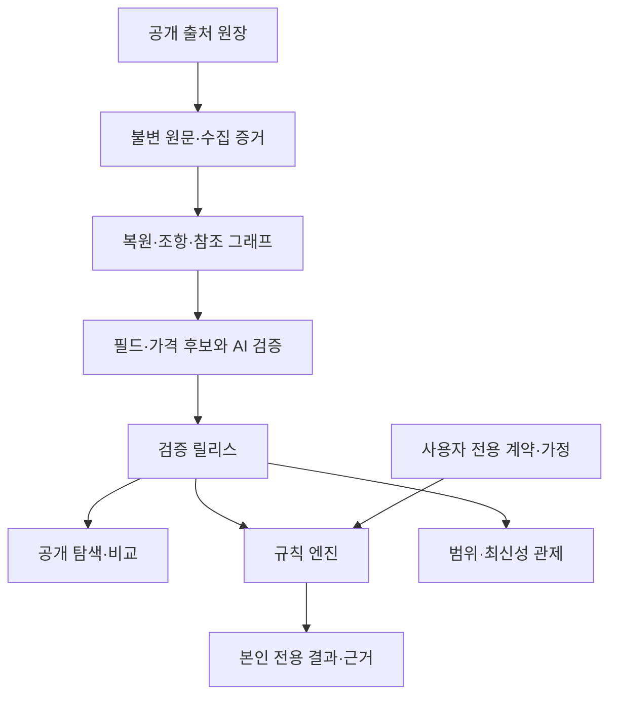

# 온전 시스템·데이터·수락 계약 v1.0

2026-10-09 | 상위: [단일 설계도](../BLUEPRINT.md) | 구현 완료 보고가 아님

## 0. 역할

이 문서는 `docs/BLUEPRINT.md`의 하위 실행 계약이다. 단일 설계도의 A·Q·L·I·M 체계를 유지하면서 데이터·화면·API·수락 조건의 세부 연결을 제공한다. 별도의 제품 범위나 출시 순서를 만들지 않는다. 최신 사용자 결정은 문서보다 우선하며 실제 문서 반영은 ADR로 추적한다.

확정은 사용자 결정, 설계 기준은 구현 계약, 미정은 근거가 부족한 항목이다. [요구사항 추적표](REQUIREMENTS.md)와 [결정 원장](DECISIONS.md)을 함께 사용한다. 문서 검토·코드 병합·데이터 공개·소비자 출시는 서로 다른 승인이다.

## 1. 제품의 목적: 보험상품시장의 정보비대칭 해소

소비자가 보험사·설계사의 설명에만 의존하지 않고, 보장·비지급 조건·가격의 전제·상품 차이를 이해하고 판단할 수 있게 한다. 불리한 조건도 사실과 근거로 보여주며, 상품 판매나 공포를 통한 추가 가입을 성공으로 삼지 않는다.

| 소비자의 질문 | 반드시 제공할 답 | 답을 제공했다는 증거 |
|---|---|---|
| 무엇을 샀거나 살펴보고 있나? | 적용 버전의 보장, 지급 방식, 금액 기준 | 상품·계약·담보 발생본 연결 |
| 언제 못 받거나 덜 받나? | 면책·감액·제외·한도·정의·종속 | 결론 옆 핵심 조건과 원문 |
| 이름이 같은데 무엇이 다르나? | 같은 비교축의 실제 조항 차이 | 비교 기준과 불일치 필드 |
| 왜 이 가격인가? | 보험료와 가입 조건·구성·기준일 | 가격 관측치와 원문 표·조회 조건 |
| 내 상황에서는 어떻게 되나? | 입력 가정 아래 조건부 계산, 빠진 사실 | 실행 규칙·입력·평가 경로 |
| 이 설명은 믿을 수 있나? | 원문 위치, 버전, 최신성, 미확인 이유 | 문장→필드→조항 추적 |

**제품 최상위 성과:** 보장과 제외를 이해한 비율, 잘못 알고 있던 조건의 교정, 동일 조건 비교 성공, 원문 근거 도달 성공. 상담·가입 전환율을 대신 쓰지 않는다. 소비자가 '추가 가입하지 않겠다'고 판단해도 정상 성과다.

## 2. 범위 계약

| 구분 | 범위 | 구현 경계 |
|---|---|---|
| 첫 출시 핵심 | 전 국내 보험사·전 상품·특약 및 기존 계약 식별에 필요한 판매중지 버전 조사 | 전 상품 조사와 전 담보 계산 가능 보증은 다름 |
| 첫 출시 데이터 | 공시 원문·정의·별표·사업방법서·요약서·공개 가격과 조건 | 접근 불가·미공개도 분모에 상태로 남김 |
| 첫 출시 소비자 기능 | 독립 Flutter 앱, 관심 담보 탐색, 선택 PDF, 선택 가족력, 보장·제외·가격 비교, 예산 초안, 상황 계산, 원문 확인 | 계정·상담·건강정보 제공 없이 공개 정보 탐색 |
| 첫 출시 운영 | 공개 범위·최신성 웹, 데이터 관제·AI 검증 감사, 오류 중단·복구 | 사용자 원본이나 건강정보를 공개 관제에 노출하지 않음 |
| 후속 확정 | 상담 연결·설계사 포털·개인 실견적 연계 | 비활성 인터페이스만 예약, 죽은 메뉴 금지 |
| 후속 순서 제안 | 콘텐츠·광고·구독·가족 초대·제안서 검증 | 확정 요구 삭제와 구분, 별도 활성화 결정 |
| 장기 설계 | 외부 DNA 검사 소개·사용자 선택 입력·본인 전용 AI 질문 | 기존 구현 동결 유지, 파생정보까지 전달 금지 |
| 별도 조사 | 공제·우체국보험 | 별도 후보 분모, 포함 결정 전 확보율 혼합 금지 |

계약 입력은 PDF 단일 경로이며 선택 사항이다. 카메라·마이데이터·웹 체험판을 임의 추가하지 않는다. 출시는 기존 단일 출시 결정을 유지한다. 아래 단계는 내부 설계·구축·검증 순서이며 공개 MVP나 시장 범위 축소가 아니다.

## 3. 핵심 사용자 여정과 화면 계약

주 시각 기준은 [사용자가 선택한 화면](../design/assets/selected-my-plan.png)이다. 따뜻한 아이보리·테라코타, 큰 제목과 숫자, 충분한 여백, 담보 행, 동일 크기 탭을 유지한다. 상태 배지 중심 관리 화면이나 격자 점수판으로 대체하지 않는다.

| 여정 | 순서 | 완료 조건 |
|---|---|---|
| 계약 없이 알아보기 | 관심 담보→보장·제외→상품 차이→원문 | 가입·상담 없이 확인, 미제출을 무보험으로 추정하지 않음 |
| 내 보험 이해하기 | PDF 선택→추출 결과 확인→버전 연결→보장·제외 | 연결 불확실 계약의 개인 계산은 보류 |
| 예산으로 비교 | 월 지출 상한→공시 비교 조건→현재 유지/보완안→두 안 차이 | 얻는 것·잃는 것·가격 기준을 함께 확인 |
| 상황에 적용 | 상황 선택→내 가정 입력→조건부 결과→근거 | 부족한 사실과 조건을 확정값처럼 표시하지 않음 |
| 가족력 참고 | 별도 동의→최소 선택 입력→관심 담보·확인 질문 | 진단·발병 확률·필요 보험금 자동 생성 금지 |
| 오류 확인 | 결과의 오류 신고→접수→영향 상태 표시 | 자유 입력에 민감정보가 섞여도 공개하지 않음 |

예산은 사용자가 정한 지출 상한이다. 15만 원은 견본 숫자이며 자동 목표가 아니다. '현재 유지'는 변경하지 않은 기준안, '보완안'은 사용자 편집 초안이다. `plan_action`과 데이터 준비 상태를 분리한다. '추가 검토'가 AI의 가입 권고처럼 보이지 않게 선택 이유를 표시한다.

화면의 첫 층은 **무엇을 보장하나 / 언제 못 받나 / 무엇이 다른가**다. 금액을 뒤집는 제외·감액을 더보기로 숨기지 않는다. 나머지는 의미별 묶음·남은 조건 수·전체 보기로 정리한다. 80자와 5초·30초는 제안 기준이며 중요한 제한 삭제의 근거가 아니다.

상세: [화면 흐름](../design/CONSUMER_FLOW_SPEC.md), [조작 상세](../design/화면_조작_설계서.md).

## 4. 데이터 아키텍처와 권한 경계

| 모듈 | 책임 | 받아서는 안 되는 권한·역할 |
|---|---|---|
| 발견·수집 워커 | 분모·요청·원문 보존·변경 신호 | 사용자 계약·건강 DB 접근 |
| 문서 복원 | 텍스트/OCR·표·좌표·각주 | 지급 결정·상품 추천 |
| 라벨 추출 AI | 후보 필드·참조·설명 제안 | 서비스 데이터 직접 공개·외부 실행 권한 |
| 검증·컴파일 | 코드 검사·AI 대조·DSL·후보 릴리스 | 다수결로 충돌 무시 |
| 공개 검색·비교 API | 릴리스에 포함된 필드·가격·근거 | 개인자료 검색 색인화 |
| 규칙 엔진 | 허용 DSL의 결정적 계산·trace | LLM 문장으로 금액 계산 |
| 개인 데이터 서비스 | 계약 매핑·가정·동의·초안·삭제 | 공개 코퍼스로 원본 환류 |
| 설명 서비스 | 검증 결과와 근거를 쉬운 문장으로 표현 | 없는 조건·순위·금액 생성 |
| 관제 | 소스 상태·분모·hold·릴리스 감사 | 사용자 원본 상시 열람 |

Rust 백엔드·규칙 엔진, Flutter 앱, 문서 복원용 격리 Python 워커는 기존 결정이다. PostgreSQL·객체 저장소·큐의 책임을 분리한다. 운영 공급자·배포 서비스는 미정이며 특정 업체 선택으로 제품 범위를 바꾸지 않는다. 공개 검색 색인·벡터 저장소는 파생 탐색 수단이고 계산의 권위 데이터가 아니다.

## 5. 데이터 식별·시간·근거 계약

| 객체 | 식별과 필수 관계 | 불변 조건 |
|---|---|---|
| SourceRegistry | 기관·채널·허용 경로·어댑터·조회 격자 | 시도와 성공을 분리 |
| DiscoveryManifest | 조사 회차×회사×판매상태×채널×기간×문서종류 | 빈 결과와 미탐색을 구분 |
| ProductVersion | 상품 계보·개정판·채널·적용 기간 | 이름만으로 병합 금지 |
| DocumentOccurrence | source_id·바이트 해시·관측 시각·상품 버전 | 같은 URL의 과거 내용 보존 |
| ClauseOccurrence | 문서·조항 경로·페이지·좌표·표/각주 | 정확 인용과 적용 범위 |
| CoverageOccurrence | 담보 개념·상품/특약 발생본·정의·참조 | 공통 개념과 상품별 조건 분리 |
| FieldAssertion | 원값·정규값·단위·근거·검증 상태 | 필드별 미확인 사유 |
| PremiumObservation | 가격·조건·구성·근거·적용 기간 | 다른 조건의 가격 병합 금지 |
| RuleArtifact | 불변 DSL·버전·내용 해시·근거 | 검증 후 수정 불가, 변경 시 새 아티팩트 |
| ReleaseManifest | 문서·사전·모델·추출기·규칙·엔진 버전 | 의존성 묶음을 원자적으로 공개 |
| ContractSnapshot | 사용자 소유·PDF·확인 필드·버전 매핑 | 원문 공시 DB와 분리 |
| Evaluation | 입력 스냅샷·규칙 해시·release_id·결과·trace | 과거 결과 재현과 철회 상태 추적 |

기록 시점(`observed_at/recorded_at`)과 실제 적용 기간(`effective_from/to`)을 분리한다. 효력일 미상은 수집일로 대체하지 않는다. 당일 새 가격·약관이 발견돼도 과거 계약 적용본을 덮어쓰지 않는다. 날짜와 시각을 분리하고 시각 조건을 일자로 절삭하지 않는다. 현재 엔진이 지원하지 않는 형식은 데이터 이용 등급을 제한한다.

원문이 지워져도 보존한 공개 문서 버전으로 과거 계산을 재현한다. 반대로 개인 삭제 요청은 원문 보존 원칙의 예외다. 공개 자료 불변성과 개인자료 무기한 보존을 혼동하지 않는다.

## 6. 수집의 정확성·적시성·완전성

### 6.1 조사와 분모

감독기관·협회 목록과 보험사 공시실 경로를 대조한다. AI는 탐색 후보를 만들고, 크롤러는 조회 조건·페이지 종료·문서 링크·본문 참조를 증거로 남긴다. 분모는 발견된 상품 수 하나가 아니라 기관·상품 버전·기대 문서·조항·참조·가격 지점별로 관리한다.

전수 조사를 지향하되 전체 확보를 입증하지 못하면 '전체 확보'라고 표시하지 않는다. 종속된 두 AI 조사의 일치나 신규 발견 0건, 포획 추정으로 누락 없음 판정을 하지 않는다. 미탐색·미공개·차단·실패·문서 미발견을 별도로 공개한다. 조사 예산을 넘으면 미해결 큐를 남기고 종료하며 무한 탐색을 하지 않는다.

### 6.2 어댑터와 갱신

어댑터 계약은 목록 열거, 버전 식별, 원문 확보, 참조 추적, 가격 격자 조사, 상태 보고다. 허용 호스트·경로·속도·동시성·재시도 상한을 소스별 관리한다. 로그인·차단을 우회하지 않는다. 요청 허용량이 조사 목표보다 작으면 목표를 달성했다고 숨기지 않는다.

모든 등록 소스의 일일 확인을 운영 목표로 둔다. 조건부 요청과 주기적 바이트 대조를 함께 사용한다. 발견 지연·수집 지연·검증 지연·공개 지연을 따로 측정한다. 게시 시각이 없으면 최초 관측 구간만 알 수 있다. 마지막 시도·마지막 성공·문서 적용일을 소비자 화면에서 구분한다.

다운로드 성공은 상태코드 200만으로 판단하지 않는다. MIME·길이·페이지·형식·해시를 확인하고 로그인 HTML·깨진 PDF를 격리한다. 동일 원문 재시도는 멱등 처리하되 발견 경로는 보존한다. 요청 실패가 판매 중단이나 가격 미공개로 바뀌어서는 안 된다.

### 6.3 복원·변경

텍스트·스캔·혼합 PDF를 페이지 단위로 분기한다. 표 병합 셀·열 머리글·단위·각주·별표를 함께 복원한다. 부정어·날짜·숫자·단위에 불확실성이 있으면 중요 필드를 hold한다.

변경은 바이트→구조→의미 순서로 검증한다. 변경 조항과 정의·별표·각주·역참조·특약 덮어쓰기의 영향 집합을 다시 처리한다. 범위 불명확 시 전체 문서/상품 버전으로 확대한다. 약관이 같아도 가격·할인·채널 변경은 가격 비교를 재평가한다.

세부 기준: [데이터 파이프라인 계약](../data/DATA_PIPELINE_CONTRACT.md).

## 7. 라벨링 방법과 승격 조건

### 7.1 라벨 축

라벨 사전은 식별, 지급 사건, 질환 정의, 지급 방식, 면책/감액/제외, 한도, 기산점, 갱신/종료, 환급, 주계약/특약 관계, 가격 조건을 독립 축으로 가진다. 각 라벨은 정의·포함/제외 예·단위·허용값·상충 규칙·중요도·사전 버전을 가진다. 새 표현을 발견했다고 기존 분류에 억지로 넣지 않고 후보 라벨로 격리한다.

질환명 유사성과 약관 정의의 동등성은 다르다. 질병 코드 개정판·표·예외가 다르면 비교 가능한 차이를 보여주되 같은 담보라고 합쳐 계산하지 않는다. 같은 지급 사유의 정액 담보 중복을 무조건 불필요하다고 판정하지 않는다.

### 7.2 추출과 AI 검증

1. 코드로 문서 구조·좌표·조항 후보를 고정한다.
2. AI가 원문 근거를 포함한 필드 후보를 추출한다. 근거 없는 필드는 거절한다.
3. 다른 모델 계열·다른 입력 표현으로 검증하고 누락 예외·반례를 찾는다.
4. 인용 일치·타입·단위·기산점·참조 완결·가격 구성·규칙 경계값을 코드로 검사한다.
5. 충돌은 다수결로 해결하지 않고 영향 필드를 hold한다. 해결 근거를 남겨 재승격한다.
6. 검증된 필드에서 사람용 설명과 실행 DSL을 만든다. 두 표현의 숫자·예외·버전을 대조한다.

C0는 지급 여부·금액·기산점·면책·감액·정의·한도·상품 버전·가격 조건이다. C1은 나머지 관계·갱신 정보, C2는 검색 태그·서식이다. C1이라도 실제 결과를 바꾸면 C0로 승격한다. 건별 검수는 기존 AI 검수 결정을 유지한다. AI 승인 자체가 실제 정확도의 보증은 아니다.

### 7.3 데이터 공개 자격

과거의 한 줄 이용 등급은 쓰지 않는다. 원문 검색·설명·조건 비교·가격 비교·계산은 **별도 capability**(`search`, `explain`, `compare_conditions`, `compare_price`, `simulate`, VOCABULARY.md)이며 각각 필요한 필드·근거·검증이 있어야 활성화한다. 비교 가능한 조건이 있다고 계산 가능한 것은 아니고, 계산 가능하다고 다른 상품과 동등 비교 가능한 것도 아니다. 허용 동작은 capability 검사로만 결정한다.

원문 검색은 가능하지만 설명이 보류될 수 있다. 가격이 보류돼도 확인된 보장 설명은 제공한다. 영향 없는 필드까지 전체 상품에서 숨기지 않는다.

## 8. 가격 데이터와 비교의 계약

공개 예시 보험료·요율표·허용된 공개 조회 결과를 조건과 함께 수집한다. 공개 가격 비교는 첫 출시 기능이며 개인 실견적과 구분한다.

- 비교 기준은 실제 확보된 연령·성별·직업 등 가격 조건, 가입금액, 기간, 납입주기, 구성, 채널, 할인이다. 미기재는 무조건 동일로 취급하지 않는다.
- `illustrative`는 공개 예시, `table_derived`는 공개 산식을 완전히 재현한 값, `contract_observed`는 내 계약 납입액, `quoted`는 후속 개인 견적이다. 근거 유형과 수집/검증 상태는 다른 축이다.
- 나이 사이 추정이나 근거 없는 가입금액 비례 환산은 금지한다. 명시된 산식 재현은 그 산식의 적용 범위에서만 허용한다.
- 연납÷12는 월평균으로 표시한다. 월납 보험료와 혼합하지 않는다. 갱신 첫해 가격을 평생 비용으로 확대하지 않는다.
- 주계약·특약·공유 할인·최저금액·가입 조합을 검증해야 묶음 총액을 만든다. 불명확하면 확인된 부분과 미포함 항목을 나누고 전체 예산 충족을 선언하지 않는다.
- 가격을 못 찾은 상품도 탐색에 남긴다. '우리에게 없음'과 '보험사가 공개하지 않음'을 구분한다.
- 가격순 정렬은 동일 기준·확보 범위 안에서만 가능하며 그 범위를 표시한다. 전 시장 최저가나 개인 확정 절감액으로 확대하지 않는다.

세부: [가격 계약](../data/PREMIUM_DATA_CONTRACT.md), [가격 상세](../masterplan/가격_수집_명세.md).

## 9. 디지털 트윈과 개인 적용

디지털 트윈은 확인된 약관 규칙·계약 조건·사용자 가정을 실행하는 모델이다. 인수 심사·의학적 발병 확률·보험사의 최종 지급 결정을 복제했다는 뜻이 아니다.

공개 상품 규칙, 실제 계약 스냅샷, 생활 시나리오, 이력/한도 상태를 분리한다. 계약 PDF를 상품명만으로 최신 약관에 연결하지 않는다. 버전 후보·특약 구성·가입일 근거가 충분하지 않으면 개인 계산을 보류하고 공개 비교만 제공한다.

엔진은 허용 DSL·정수 금액·명시적 반올림·3값 논리·시간 의미론을 사용한다. 실행 규칙은 검증 후 불변이다. 결과에는 rule_version, rule_content_hash, release_id, engine_version, 입력 스냅샷 해시, 근거, 평가 경로가 있다. 규칙 수준 근거만으로 여러 조항의 개별 판단을 설명하기 어려우므로 최종 소비자 연결에서는 노드별 evidence_ref를 요구한다.

실손의 공제·자기부담·비례보상·누적한도·청구 이력은 별도 연산과 상태 전이가 필요하다. 현재 엔진에 없는 연산은 AI 요약이나 화면 계산으로 대신하지 않는다. 범위 비교·시각·코드 체계 등 미지원 항목은 명시적으로 실패시키고 계산 자격에서 제외한다.

생활비·의료비·돌봄 비용은 중복 없이 구분한다. 사용자 가정과 공공 통계 참고값을 구별한다. 통계 출처가 미정이면 기본 필요액을 넣지 않는다. 비용 기간·지급 시점·비용 범위가 같고 필수값이 모두 있어야 충족률을 표시한다. 홈에 보편적인 보장 점수를 만들지 않는다.

## 10. API와 상태의 연결

다음은 버전 1 API 계약의 논리 경계다. 최종 OpenAPI는 구현 전 산출물이다.

| 경로 제안 | 기능 | 권한·필수 결과 |
|---|---|---|
| GET /v1/products | 공개 상품·버전 탐색 | 비로그인, 확보 범위·누락 상태 |
| GET /v1/coverages/{id} | 보장·제외·근거 | 필드별 capability·release_id |
| POST /v1/comparisons | 공시 조건 비교 | comparison_basis_id·가격 근거·미비교 필드 |
| GET /v1/evidence/{id} | 공개 원문과 위치 | 정확 문서 버전·페이지·좌표 |
| POST /v1/policy-imports | 개인 PDF 업로드 | 본인 인증·처리 동의·격리 저장·비동기 상태 |
| POST /v1/plans | 개인 비교 초안 | 본인 소유·plan_action·확인된 입력 |
| POST /v1/evaluations | 상황 계산 | 권한·불변 입력·규칙 버전·미확인·trace |
| GET /v1/coverage-status | 범위·최신성 | 공개 집계, 개인자료 없음 |
| POST /v1/error-reports | 근거 오류 신고 | rate limit·민감정보 격리·접수 ID |
| DELETE /v1/me/data | 개인 삭제 | 확인된 본인·삭제 작업 ID·진행 상태 |

업로드·계산 요청은 멱등 키와 상태 조회를 제공한다. 개인 응답은 공개 캐시에 저장하지 않는다. 공개 캐시는 release_id·비교 조건을 포함한다. 오래 걸리는 처리의 타임아웃을 지급 불가로 바꾸지 않는다.

상태 축은 분리하며 2026-10-09에 `docs/blueprint/VOCABULARY.md`(정본 `packages/schemas/vocabulary.json`)로 확정했다. 수집은 `acquisition_status`, 필드는 `value_state`와 `review_status`, 개인 입력은 `policy_holdings_status`, 가격은 `price_basis`·`price_unavailable_reason`·`freshness`, 초안은 `plan_action`이다. 하위 문서 표현을 별도 enum으로 만들지 않는다. 코드별 사용자 문구와 가능한 다음 행동을 계약 테스트로 고정한다. 알 수 없는 enum은 성공 상태로 기본 처리하지 않는다.

## 11. 개인정보·가족력·DNA 경계

공개 코퍼스, 사용자 계약, 선택 가족력, 향후 유전정보 저장 영역과 권한을 분리한다. 가족력은 본인의 선택 입력이며 가족 실명·연락처·검사 원본을 불필요하게 수집하지 않는다. 입력하지 않아도 비교 기능을 사용할 수 있다.

DNA 원본·취약점·질문·AI 추론·이를 사용한 설계에는 `genetic_private`가 전파된다. 보험사·설계사·광고로 전달하는 기능은 만들지 않으며 사용자 공유 동의로 이 경계를 해제하지 않는다. 외부 AI 처리 여부·항목·보존 정책은 별도 처리 경계로 확인한다. 장기 설계가 존재한다고 첫 출시 메뉴를 켜지 않는다.

이벤트 분석·로그·크래시·지원 티켓·프롬프트 추적에 계약 원문·금액·건강정보를 자동 전송하지 않는다. 허용 이벤트는 화면 ID·상태 코드·지연·오류 종류다. 개인 원문에서 발견한 분모 누락 신호는 개인정보를 제거한 공개 상품 식별 후보만 재조사 큐로 보낸다.

삭제는 원본→추출값→색인→캐시→파생 결과→외부 처리본 순으로 범위를 추적하며, 백업 보존 기간과 삭제 완료 의미는 출시 전 확정한다. 미정인 상태에서 즉시 완전 삭제를 약속하지 않는다. 삭제 완료 후 복구·재처리로 되살리지 않는 테스트가 필요하다.

## 12. 데이터 릴리스와 운영

원문·추출·검증·컴파일·후보·공개를 별도 상태로 저장한다. AI가 출력했다고 공개하지 않는다. 중요 필드 근거·참조·경계 테스트·이중 표현 일치·그림자 비교가 통과한 capability만 공개한다.

명세·사전·모델·프롬프트·엔진 변경도 원문 변경과 같은 영향 평가 대상이다. 새/옛 규칙에 동일 입력을 넣어 차이를 확인하며 설명되지 않는 지급액 차이는 차단한다. 잘못된 규칙은 영향 상품/계약/초안을 추적해 해당 계산을 중단하고 정정 이력을 남긴다. 위험한 과거 규칙으로의 단순 롤백을 정상 복구로 취급하지 않는다.

관제에는 분모별 확보율, 참조 해결률, 가격 조건 완비율, 설명/비교/계산 가능률, 지연, 실패·hold·모델 불일치·비용·재시도를 표시한다. 평균 하나로 취약 보험사·문서 형식을 가리지 않는다. 정책 소유자가 중단·재개·임계값을 관리하되 건별 사람 검수로 몰래 전환하지 않는다.

## 13. 검증 기준과 완료의 의미

| 층 | 무엇을 확인하나 | 통과 기준 |
|---|---|---|
| 설계 | 요구 ID·소유 모듈·데이터·화면·미정 | 빠진 연결 없음, 충돌 해소 |
| 원문 | 합성·표본의 다운로드/페이지/참조 | 오류 응답을 정상 원문으로 승인하지 않음 |
| 라벨 | 알려진 정답·변이·실제 원문 교차 검증 | C0 필수 검사 통과, 불일치는 hold |
| 계산 | 경계·윤년·반올림·범위·unknown·이력 | 골든 기대값·재현성·오버플로 검사 통과 |
| 가격 | 단위·구성·조건·할인·기준일 | 다른 기준 혼합·근거 없는 환산 없음 |
| 표현 | 사람 설명과 구조화 필드 대조 | 금액·기간·예외 일치, 결정적 제한 노출 |
| 권한 | 비로그인 탐색·개인 영역·파생정보 | 다른 사용자·광고·설계사 누출 없음 |
| 운영 | 변경 영향·원자 공개·롤백·삭제 | 시나리오별 결과와 감사 이력 재현 |
| 사용자 이해 | 보장/제외/가격 조건/근거 과제 | 기준은 조사 계획에 사전 고정하고 실패 원인 기록 |

합성 정답 테스트는 구현을 검증하지만 실제 약관 정확도를 보증하지 않는다. AI 재추출 일치도 실제 오류율이 아니다. 평가셋을 보험사·상품군·문서 형식·버전·중요도별로 분리하고 같은 상품 계열이 평가에 누출되지 않게 한다. 모델 다수결이나 3/n으로 실제 오류율 상한을 만들지 않는다.

출시 전 수치가 필요한 운영·사용성 임계값은 결정 원장에서 해소해야 한다. 아직 정하지 않았다고 무한 출시도, 임의 완성 선언도 하지 않는다. 필수 게이트 미완료는 해당 출시 게이트가 미완료라는 뜻이다.

## 14. 구축 순서와 실증 확장

상위 설계도 M0~M6 순서를 따른다. M1은 데이터 계약과 스키마, M2는 실제 원문 1건의 전체 흐름 실증, M3는 조사·수집 확장, M4는 조건·가격 비교, M5는 개인 적용, M6는 상품군 확장과 출시 게이트다. 내부 단계이며 단일 출시 결정이나 전 상품 조사 범위를 줄이지 않는다.

M2의 한 건 성공만으로 일반화하지 않는다. M3~M6에서는 텍스트/스캔/표·별표·동명이담보·판매중지/개정·가격 유무·정액/실손을 포함한 검증 묶음을 선정하고 근거를 남긴다. 지원하지 않는 계산은 해당 없음이 아니라 미지원으로 남긴다.

## 15. 구현 변경을 통제하는 방법

모든 구현 PR은 요구 ID, 변경 데이터 계약, 소비자 화면 영향, 기대 결과와 검증, 미정 사항을 적는다. 요구 ID가 없으면 선행 설계 변경인지부터 밝힌다. 기존 불변 원칙은 별도 PR 체크리스트로 유지한다.

다음 변경은 설계 변경 없이 구현하지 않는다: 공개 가격 제외, 가족력 제거, DNA 공유, 상담 강제, 원문 없는 계산, 미확인 0원 처리, 광고 기반 정렬, 사용자 선택 화면 교체, 조사 범위 축소, 새로운 개인자료 수집.

단순 라이브러리·내부 코드 정리는 모듈 책임과 계약을 유지하면 구현 PR에서 결정할 수 있다. 의미가 바뀌는 라벨·산식·비교 기준은 스키마/사전 버전·데이터 재처리·화면·과거 결과 영향을 함께 변경한다. 문서만 고치고 회귀 사례를 생략하지 않는다.
