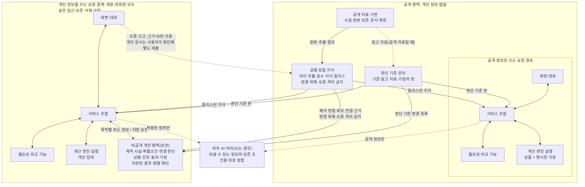

# 전체 구조 1차 정리 (토의용)

상태: **토의 자료. 미확정.** 2026-10-10 | 9차 토의 반영

- 지금까지의 전체 구조·연결 토의를 **구조도 하나**와 **영역별 읽기·쓰기·책임 표 하나**로 모았다. 이것을 보고 중복 책임과 빠진 연결을 확인한 뒤 세부 데이터 모델로 내려간다(사용자 지정).
- 출처: [소비자 기능과 전체 구조](소비자_기능_필요정보.md) §3(1~5차), [레이어 간 연결](레이어_연결.md), [불확실·오류 상황 시험](불확실_상황_시험.md)(6~8차), [흐름 따라가기: 암 보장](흐름_따라가기_암보장.md).
- **9차 토의(사용자 제시)로 바뀐 것:** 개인 정보 경계를 개인 계산에만 두지 않고 **개인 정보를 쓰는 요청 전체**에 적용한다. 중복 3건과 빠진 연결 5건은 사용자 의견대로 정리했다(§4). 삭제 후 진행 중 작업이 데이터를 다시 남기지 않는 흐름을 더했다(§5). 1차 점검에서 구현자가 낸 안 가운데 채택하지 않은 것은 §4에 표시했다.

## 1. 구조도

- **같은 기능 코드, 다른 처리 경계.** 화면·대화, 서비스 조합, 필요성·비교 기능, 계산 엔진은 코드가 같지만, 개인 정보를 쓰는 요청은 개인 정보 경계 안에서 처리한다. 공개 정보만 쓰는 요청은 개인 정보를 받지 않는다.
- **경계 안의 모든 기능에 같은 규칙.** 개인 정보 경계 안의 화면·대화, 서비스 조합, 판단 기능, 계산 실행은 개인 영역과 같은 접근·보존·삭제 규칙을 따른다. 필요성 분석은 소득·가족 상황을, 비교는 기존 계약을, 대화는 사용자가 말한 개인 정보를 읽기 때문이다.
- **비회원도 경계 안에 들어온다.** 계정이 없어도 개인 정보를 입력할 수 있다. 저장하지 않는 비회원 세션도 같은 경계와 규칙을 따른다.
- **외부 AI 처리는 경계 밖에 따로 그렸다.** 쓰는 경우 무엇을 보낼 수 있는지, 그쪽에서 얼마나 보존되는지를 따로 정해야 한다(미정).

세 흐름:
- **지식 생산**(A → B, A ⇢ C): 새로 수집했다고 곧바로 서비스에 반영하지 않는다. 서비스는 릴리스된 지식과 판단 기준만 읽는다.
- **소비자 요청**: 한 요청에서 쓴 입력과 판을 고정한다. 공개 정보만 쓰는 요청과 개인 정보를 쓰는 요청은 처리 경계가 다르다.
- **변경·정정**(B·C → E → G2 → H2): 새 릴리스는 "우리가 아는 내용이 바뀌었다"는 뜻이다. E가 변경 목록을 자기 기록과 대조해 확인된 범위에서만 다시 하고, 과거 결과는 보존한다.

## 2. 영역별 읽기·쓰기·책임

| 영역 | 읽는 것 | 쓰는 것 | 책임 | 하지 않는 것 | 갖는 판 |
|---|---|---|---|---|---|
| **A 공개 자료 기반** | 공개 출처(접근 판정 안에서) | 원본(한 번만 쓰기), 관측 기록, 추출 결과 | 무엇을 어디서 언제 확보했는지 증명. 실패·차단도 기록 | 원본 덮어쓰기·삭제, 서비스 반영 | 원본 해시, 어댑터·추출기 판 |
| **B 공통 보험 지식** | A의 원본·추출 결과, 근거 ID로 들어온 오류 신고 | 검수된 사실·판단·실행 규칙·확인 상태, **릴리스**, **변경 목록**(종류·범위·이유·심각도·범위 특정 여부), **오류 격리 공지** | 보험이 무엇을 보장하고 어떤 조건으로 작동하는지 근거와 함께 표현. 확인된 오류를 정정 전에도 격리 | 사람에 대한 판단, 개인 정보 받기 | 지식 릴리스(규칙 판 포함) |
| **C 판단 기준 관리** | (공개 자료라면) A의 참고 자료 | 판단 기준·참고 자료·기본 가정, 판, 변경 목록 | 무엇을 우선 고려할지를 근거와 판으로 설명 | 약관 사실 | 판단 기준 판 |
| **D 계산 엔진** | 요청에 담긴 규칙·계약 표현·사건·입력 성격 | 없음(상태 없음). 개인 입력 실행은 개인 정보 경계 안에서, 요청 로그·오류 기록·캐시에 남기지 않음 | 단일 계약과 여러 계약의 지급 관계 계산. **계산 전에 규칙 호환을 검사**하고, 지원하지 않는 규칙은 실행하지 않음 | 지원하지 않는 관계 합산, 0원과 미지원 혼동 | 엔진 판 |
| **E 비공개 개인 영역** | B의 후보·연결 근거·해석 방법·변경 목록·오류 공지, C의 변경 목록 | 기록 유형별 판(계약 사실의 출처 층, 특별조건, 상품 연결 판단, 계약 가치, 제출 범위 진술, 개인 상황, 선호, 동의, 가정 시나리오), **사용자가 저장한 결과**와 그 상태, 삭제 표시 | 일관된 내 계약 표현. 변경 목록으로 영향 확인. 릴리스 간 연결 유효성 판단. 삭제 요청의 기점 | 새 릴리스에 자동 재연결, 공통 유형에 억지로 맞추기, 공개 영역에 개인 정보 보내기 | 기록 유형별 판 |
| **F 필요성·비교 기능** (공개 경로 / 개인 경계) | G가 넘긴 지식 조회 결과, 계산 결과, 판단 기준, (개인 경계에서) 최소 개인 정보·선호 | 공통 결과 구조, 조건의 두 축, 결론을 바꾸는 입력 목록, **자기 판단의 의존 기록** | 후보와 득실, 질문 구성 | 지식·개인 기록 수정, 종합점수, 중요 조건 일괄 지정 | 기능 판 |
| **G 서비스 조합** (공개 경로 / 개인 경계) | H의 요청, B·C·D·F의 결과, (개인 경계에서) E | 요청의 판 고정 묶음, 결과 묶음, 각 기능이 낸 의존 기록의 **연결**. 사용자가 저장하면 E에 저장 요청 | 기능 호출, 판 혼합 검사, **공통 판정 규칙으로 결과 상태 판정**(진행 중·비회원 요청), 오류·미확인 전달 | 순위·지급 조건 변경, **빠진 의존 기록을 추측해서 채움**, 저장하지 않은 탐색의 영속 보관 | — |
| **H 화면·대화** (공개 경로 / 개인 경계) | G의 결과 | 사용자 요청. 사실·선호·가정은 사용자 확인 뒤 G를 거쳐 E에. 근거 ID 기반 오류 신고 | 결정적 정보부터 짧게, 상태가 겹치면 중요한 것부터 요약. 사용자의 사실과 의도 확인 | 결과에 없는 숫자·조건 생성, 약관 해석을 사용자에게 넘김, 검수된 지식 수정, 개인 문서를 신고에 자동 첨부 | — |
| **X 외부 AI 처리**(쓰는 경우) | 보내기로 허용된 정보만 | 그쪽 보존 조건에 따름 | 각 영역의 제한된 도구 역할 | 검수된 지식 수정, 지급액·가격·적용 조건 확정 | — |

**공통 판정 규칙(영역이 아니라 규칙):** 결과 상태의 네 축(입력 최신성 / 지식 최신성 / 오류에 따른 사용 제한 / 재현 가능 여부)을 판정하는 규칙은 하나로 관리한다. E는 저장된 결과에, G는 진행 중·비회원 요청에 **같은 규칙**을 적용한다. 판정의 일관성과 저장 여부는 별개다.

**공통 규칙(나머지):**
- 확인된 정보는 계속 제공하되, 미확인 사항의 영향을 받는 결론은 확정하지 않는다. 어디까지 영향을 받는지 모르는 경우도 명시한다.
- 의존 기록은 각 기능(D·F·G)이 자기 판단·계산에 대해 만든다. G는 연결만 하고, 빠진 기록을 추측하지 않는다. 의존 기록이 없는 결과는 "의존 미확인"이 되어, 관련 변경이 생기면 넓게 다시 검토한다.
- 조건에는 두 축이 붙는다: 결과 영향(적용을 막음 / 결과를 바꿈 / 사용자가 중요하게 봄 / 추가 설명)과 행동 전 확인.
- 사용자 수정은 무엇을 수정했는가에 따라 처리한다([불확실·오류 상황 시험](불확실_상황_시험.md) §6).

## 3. 흐름별로 본 연결 목록

| 흐름 | 연결 | 자세한 표 |
|---|---|---|
| 지식 생산 | L1~L5, **L6 오류 확인 → 오류 격리 공지**, **L7 근거 ID 오류 신고 → 검수 대기열** | [레이어 연결](레이어_연결.md) §3.1 |
| 소비자 요청 | Q1~Q8. 공개 경로와 개인 정보 경계가 나뉨 | 같은 문서 §3.2 |
| 변경·정정 | C1~C6 | 같은 문서 §3.3 |
| 삭제 | 본 문서 §5 | — |

## 4. 중복 책임과 빠진 연결의 정리 (9차, 사용자 의견 반영)

### 4.1 중복 책임

| 항목 | 정리(사용자) | 1차 점검의 구현자 안 |
|---|---|---|
| 결과의 사용 가능 여부 | 판정 규칙을 공통으로 관리한다. 개인 영역은 저장된 결과의 상태를 관리하고, 진행 중·비회원 요청도 같은 규칙을 적용한다 | ~~G가 화면에 보인 결과를 곧바로 E에 저장~~ **채택하지 않음.** 저장 여부와 판정 일관성은 별개다. 사용자가 저장하지 않은 탐색까지 영속 보관할 이유가 없다 |
| 의존 기록 | 각 기능이 자기 판단·계산의 의존성을 생성하고 서비스 조합이 연결한다. 누락된 의존 기록을 조합 단계가 추측해서 채우지 않는다 | 같은 방향 |
| 추출 코드 재사용 | 공통 라이브러리를 재사용하되 실행·저장은 분리한다. 공시 문서와 개인 증권의 추출 설정·모델·배포 판까지 항상 같게 강제할 필요는 없다 | ~~코드와 판은 하나로 관리~~ **바뀜.** 각 기록에 어떤 설정·모델·배포 판으로 읽었는지를 남긴다 |

### 4.2 빠진 연결

| 항목 | 보완(사용자) |
|---|---|
| 오류 신고 | 공개 상품·조항·결과의 오류는 해당 근거 ID로 신고한다. 개인 문서가 필요한 신고는 자동 전송하지 않고, 사용자가 내용을 확인해 별도로 제출한다. 개인정보가 든 신고를 공통 지식에 바로 넣지 않는다 |
| 계정 없는 사용 | 세션 동안 선호·가정을 쓸 수 있다. 다만 "저장하지 않는다"는 문구는 서버 로그·브라우저 저장·외부 AI 보존까지 검토한 뒤 쓴다. 비회원도 개인정보를 입력할 수 있다는 점을 포함한다 |
| 삭제 전파 | 진행 중 작업을 취소하거나 결과 저장을 차단해서, 삭제 직후 늦게 끝난 작업이 데이터를 다시 만들지 못하게 한다. 캐시·대화·파생 결과·백업의 처리를 구분한다(§5) |
| 릴리스 간 연결 유효성 | 개인 영역이 판단한다. 판 번호가 다르다는 이유만으로 무효화하지 않고, 해당 연결에 영향을 주는 변경인지 확인한다. 변경 이력이 부족하면 미확인으로 둔다 |
| 엔진·규칙 호환 | 계산 전에 검사한다. 지원되지 않는 규칙은 실행하지 않고, 그 규칙에 의존하지 않는 설명·비교 기능은 유지한다 |

## 5. 삭제 흐름 (진행 중 작업이 데이터를 다시 남기지 않게)

| 단계 | 하는 일 | 누가 |
|---|---|---|
| ① 삭제 요청 | 무엇을 지울지(전체 / 특정 계약 / 특정 기록) | 사용자 → H2 → G2 → E |
| ② 삭제 표시 | 지울 대상에 삭제 표시를 먼저 남긴다. 표시에는 내용 없이 "삭제됨"과 시각만 둔다 | E |
| ③ 진행 중 작업 차단 | 그 대상을 쓰는 진행 중 요청을 취소하고, 대기 중인 재검토·재계산 작업을 지운다 | G2, E |
| ④ 늦게 끝난 작업 거부 | 삭제 표시 뒤에 도착한 결과·저장 요청은 저장 단계에서 거부한다(저장하지 않고 화면에도 보이지 않음). 이 검사가 없으면 취소가 늦은 작업이 지운 데이터를 다시 만든다 | E의 저장 단계, G2 |
| ⑤ 데이터 종류별 처리 | 아래 표 | E, G2, H2, D2, X |
| ⑥ 사용자 안내 | 지운 범위와 남는 것(백업 기한, 외부 AI 쪽 보존 조건 등)을 그대로 알린다 | H2 |

| 데이터 종류 | 처리 |
|---|---|
| 원본(증권 PDF)·계약 사실·특별조건·상황·선호·동의·가정 | 즉시 삭제 |
| 파생 결과(추출 결과, 저장된 계산·비교 결과, 의존 기록) | 즉시 삭제 |
| 캐시 | 무효화. 사용자 단위로 지울 수 있게 묶여 있어야 함 |
| 대화 기록·세션 상태(비회원 포함) | 삭제. 세션 종료도 같은 처리 |
| 로그 | 개인 정보를 남기지 않는 것이 원칙. 남는 운영 기록은 식별 정보를 빼고 보존 기한을 둠 |
| 백업 | 즉시 지울 수 없으면 보존 기한 뒤 소멸. **복원할 때 삭제 표시를 다시 적용해** 지운 데이터를 되살리지 않음 |
| 외부 AI에 보낸 내용(쓰는 경우) | 그쪽 보존 조건에 따름. 미리 확인해 사용자 안내에 넣음(미정) |
| 공개 영역 | 지울 것이 없음(개인 정보를 받지 않으므로) |

## 6. 세부 데이터 모델로 넘길 것

**설계 기준(사용자 제시):** 객체 이름부터 늘리지 않는다. 이 구조를 지키려면 **무엇을 보존하고, 무엇을 연결하고, 무엇을 정정·삭제할 수 있어야 하는지**를 기준으로 설계한다.

그 기준으로 넘길 재료:
- 보류 중인 [데이터 모델 토의 보완안](데이터모델_토의_보완안.md): 관측과 판단의 분리, 상품 후보의 형태, 판매 구성 구분 기준
- 이 구조에서 나온 요구: 개인 기록 유형별 판과 값의 출처 층, 특별조건 기록, 계약 가치(기준일·출처), 제출 범위 진술, 가정 시나리오, 사용자가 저장한 결과(판 묶음·의존 기록·상태 네 축), 변경 항목, 오류 격리 공지, 조건의 두 축, 삭제 표시
- 갈아타기 검증의 보완 후보 다섯 가지([레이어 연결](레이어_연결.md) §5.4)
