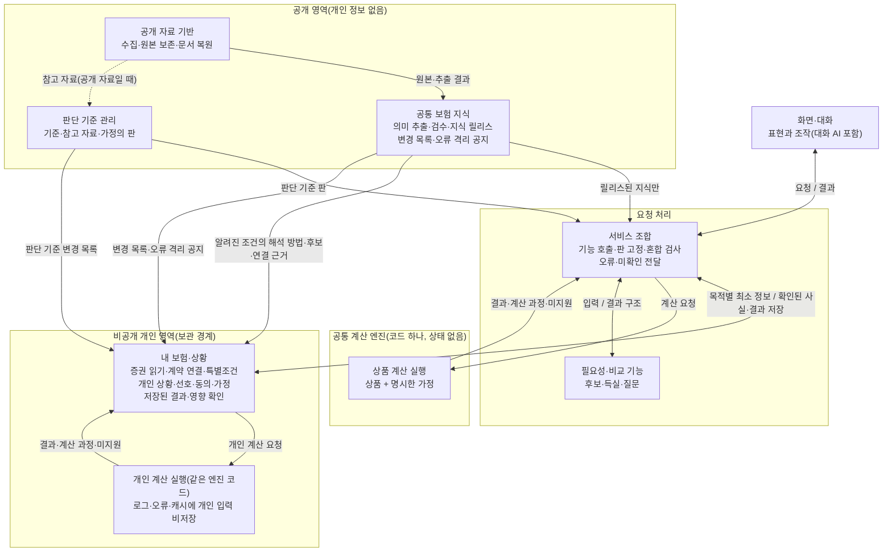

# 전체 구조 1차 정리 (토의용)

상태: **토의 자료. 미확정.** 2026-10-10

- 지금까지의 전체 구조·연결 토의를 **구조도 하나**와 **영역별 읽기·쓰기·책임 표 하나**로 모았다. 이것을 보고 중복 책임과 빠진 연결을 확인한 뒤 세부 데이터 모델로 내려간다(사용자 지정).
- 출처: [소비자 기능과 전체 구조](소비자_기능_필요정보.md) §3(사용자 제시 1~5차), [레이어 간 연결](레이어_연결.md), [불확실·오류 상황 시험](불확실_상황_시험.md)(6~8차), [흐름 따라가기: 암 보장](흐름_따라가기_암보장.md). 정리하면서 새로 정한 것은 없다. §4의 점검 결과만 구현자 의견이다.

## 1. 구조도

세 흐름:
- **지식 생산**(A → B, A ⇢ C): 새로 수집했다고 곧바로 서비스에 반영하지 않는다. 서비스는 릴리스된 지식과 판단 기준만 읽는다.
- **소비자 요청**(H → G → B·C·E·D·F → G → H): 한 요청에서 쓴 입력과 판을 고정한다. 결과와 그 판 묶음, 의존 기록은 E에 저장한다.
- **변경·정정**(B·C → E → G → H): 새 릴리스는 "우리가 아는 내용이 바뀌었다"는 뜻이다. E가 변경 목록을 자기 기록과 대조해 확인된 범위에서만 다시 하고, 과거 결과는 보존한다.

## 2. 영역별 읽기·쓰기·책임

| 영역 | 읽는 것 | 쓰는 것 | 책임 | 하지 않는 것 | 갖는 판 |
|---|---|---|---|---|---|
| **A 공개 자료 기반** | 공개 출처(접근 판정 안에서) | 원본(한 번만 쓰기), 관측 기록, 추출 결과 | 무엇을 어디서 언제 확보했는지 증명. 실패·차단도 기록 | 원본 덮어쓰기·삭제, 서비스 반영 | 원본 해시, 어댑터·추출기 판 |
| **B 공통 보험 지식** | A의 원본·추출 결과 | 검수된 사실·판단(동일성·대응·적용 관계)·실행 규칙·확인 상태, **릴리스**, **변경 목록**(종류·범위·이유·심각도·범위 특정 여부), **오류 격리 공지** | 보험이 무엇을 보장하고 어떤 조건으로 작동하는지 근거와 함께 표현. 확인된 오류를 정정 전에도 격리 | 사람에 대한 판단, 개인 정보 읽기 | 지식 릴리스(규칙 판 포함) |
| **C 판단 기준 관리** | (공개 자료라면) A의 참고 자료 | 판단 기준·참고 자료·기본 가정, 판, 변경 목록 | 어떤 상황에서 무엇을 우선 고려할지를 근거와 판으로 설명 | 약관 사실 | 판단 기준 판 |
| **D 공통 계산 엔진** | 요청에 담긴 규칙·계약 표현·사건·입력 성격(실제/가정) | 없음(상태 없음). 개인 입력 실행은 개인 영역 경계 안에서, 요청 로그·오류 기록·캐시에도 남기지 않음 | 확인된 규칙과 입력으로 결과 산출. 단일 계약과 **여러 계약의 지급 관계** | 지원하지 않는 관계를 합산, 0원과 미지원을 섞음, 가정을 실제로 바꿈 | 엔진 판 |
| **E 비공개 개인 영역** | B의 후보·연결 근거·해석 방법·변경 목록·오류 공지, C의 변경 목록, D(개인 실행) 결과 | 기록 유형별 판: 계약 사실(출처 층: 원문 추출 / 사용자 수정 / 사용자 확인 / 가정), 특별조건(원문 위치·읽기 확실성·해석 상태·영향 범위 상태), 상품 연결 판단, 계약 가치(기준일·출처), 제출 범위 진술, 개인 상황, 선호, 동의, 가정 시나리오, 저장된 결과(판 묶음·의존 기록·현재 사용 가능 여부의 네 축) | 증권 읽기, 계약 연결 관리, 모든 기능이 함께 쓰는 **일관된 내 계약 표현**. 변경 목록으로 영향 확인과 재검토 | 새 릴리스에 자동 재연결, 공통 유형에 억지로 맞추기, 공개 영역에 개인 정보 보내기 | 기록 유형별 판 |
| **F 필요성·비교 기능** | G가 넘긴 지식 조회 결과, 계산 결과, 최소 개인 정보, 판단 기준, 선호 | 공통 결과 구조(기준선·후보·이유와 차이·근거·조건·범위·불확실성·다음 행동), 조건의 성격과 **행동 전 확인** 표시, 결론을 바꾸는 입력 목록, 의존 기록 | 후보와 득실, 질문 구성 | 지식·개인 기록 수정, 종합점수, 사용자가 중요하게 볼 조건을 일괄 지정 | 기능 판 |
| **G 서비스 조합** | H의 요청, B·C·E·D·F의 결과 | 요청의 판 고정 묶음, 결과 묶음(범위·판 참조·근거 종류·다음 행동 연결), E에 결과 저장 | 기능 호출, 판 혼합 검사(영향받는 기능만 중단), 오류·미확인을 일관되게 전달, 개인 기록이 바뀌면 그에 기댄 결과만 다시 요청 | 상품 순위·지급 조건을 몰래 바꾸는 판단 | — |
| **H 화면·대화** | G의 결과 | 사용자 요청. 사실·선호·가정은 **사용자 확인 뒤** G를 거쳐 E에 | 결정적 정보부터 짧게, 나머지는 펼치게. 상태가 겹치면 중요한 것부터 요약. 사용자의 사실과 의도를 확인받음 | 결과에 없는 숫자·기간·예외·조건 생성, 약관 해석을 사용자에게 넘김, 검수된 지식 수정 | — |

**AI의 자리:** AI는 별도 레이어가 아니라 각 영역의 제한된 도구다. A·E(문서 추출), B(검수 보조, 다른 계열 교차 검토), H(대화: 말과 선호 해석, 질문 고르기, 설명 구성)에 있다. 소비자와 대화하는 AI는 B를 고치거나 지급액을 새로 만들지 않는다.

**공통 규칙(영역을 가로지르는 것):**
- 확인된 정보는 계속 제공하되, 미확인 사항의 영향을 받는 결론은 확정하지 않는다. 어디까지 영향을 받는지 모르는 경우도 명시한다.
- 결론마다 의존 기록(어떤 사실·조항·규칙·판단·입력에 기대는가)을 D·F·G가 내고, E가 결과와 함께 보관한다.
- 결과의 상태는 네 축(입력 최신성 / 지식 최신성 / 오류에 따른 사용 제한 / 재현 가능 여부)으로 따로 둔다.
- 조건에는 두 축이 붙는다. **결과 영향**(적용을 막음 / 결과를 바꿈 / 사용자가 중요하게 봄 / 추가 설명)과 **행동 전 확인**(언제 무엇을 확인하나)이다. 같은 조건에 여러 성격과 두 축이 함께 붙을 수 있다.
- 사용자 수정은 무엇을 수정했는가에 따라 처리한다([불확실·오류 상황 시험](불확실_상황_시험.md) §6).

## 3. 흐름별로 본 연결 목록

| 흐름 | 연결 | 자세한 표 |
|---|---|---|
| 지식 생산 | L1 수집→원본, L2 원본→복원, L3 복원→추출·검수, L4 검수→릴리스·변경 목록, L5 판단 기준→판, **L6 오류 확인→오류 격리 공지(새)** | [레이어 연결](레이어_연결.md) §3.1 |
| 소비자 요청 | Q1~Q8 | 같은 문서 §3.2 |
| 변경·정정 | C1~C6 | 같은 문서 §3.3 |

## 4. 모아 보니 보이는 것 (구현자 점검, 합의 전)

### 4.1 중복될 수 있는 책임

| 번호 | 중복 | 왜 문제인가 | 정리 후보 |
|---|---|---|---|
| 중복① | **결과의 현재 사용 가능 여부를 E(저장된 결과)와 G(진행 중 대화)가 각자 판단** | 같은 결과가 대화 화면과 "내 보험"에서 다른 상태로 보일 수 있다 | G가 화면에 보인 결과를 곧바로 E에 저장하고(Q8), 상태 판단은 E 한 곳의 규칙으로 한다. G는 그 상태를 읽어 전달만 |
| 중복② | **의존 기록을 D·F·G가 각자 낸다** | G가 다시 계산하면 F·D와 다른 의존이 생긴다 | D·F가 낸 것을 G는 합치기만 한다. G 자신의 판단(판 고정 등)에 대한 의존만 G가 더한다 |
| 중복③ | **증권 추출 기술이 A와 E 두 곳에서 돈다** | 추출기 판이 어긋나면 같은 문서를 다르게 읽는다 | 코드와 판은 하나로 관리하고, 실행과 저장만 나눈다. E의 기록에 추출기 판을 남긴다 |

### 4.2 빠진 연결

| 번호 | 빠진 연결 | 근거 | 연결 후보 |
|---|---|---|---|
| 빠짐① | **사용자의 근거 오류 신고 → B의 검수 대기열** | 기존 설계에 오류 신고 여정과 `POST /v1/error-reports`가 있다(SYSTEM_CONTRACT §3·§10, "자유 입력에 민감정보가 섞여도 공개하지 않음"). 지금 세 흐름에 이 경로가 없다 | H → G → (민감정보 걸러냄) → B 검수 대기열. 개인 계약에서 나온 상품 정보를 자동으로 넘기지 않는다는 O18과의 경계를 정해야 한다 |
| 빠짐② | **계정 없이 쓰는 사용자의 선호·가정이 머무는 곳** | 첫 출시는 "계정·상담·건강정보 제공 없이 공개 정보 탐색"을 포함한다(SYSTEM_CONTRACT §2). E는 개인 기록의 보관 경계인데, 저장하지 않는 사용자의 대화 중 선호·가정은 어디에 있나 | 대화 동안만 G의 요청 상태에 두고 저장하지 않음. 이때도 판 고정과 의존 기록 규칙은 같다 |
| 빠짐③ | **개인 정보 삭제의 전파** | E에서 지워도 G의 진행 중 상태, H의 화면 상태, D의 실행 환경에 남은 것이 있으면 삭제가 아니다 | 삭제 요청이 E → G·H·D(개인 실행 환경)까지 가는 경로. D는 원래 저장하지 않으므로 확인만 |
| 빠짐④ | **E의 연결 판단이 만들어진 릴리스와 G가 고정한 릴리스가 다를 때의 판정** | Q2의 "판이 맞지 않으면"을 "영향받는 기능만 중단"으로 바꿨지만, 영향 여부를 누가 판정하는지 비어 있다 | G가 E에 "릴리스 X에서 만든 이 연결이 Y에서도 유효한가"를 묻고, E가 X→Y 변경 목록으로 답한다(유효 / 재검토 필요 / 판정 불가) |
| 빠짐⑤ | **엔진과 규칙의 호환** | 규칙(B의 릴리스)과 엔진 코드(D의 판)가 따로 바뀐다 | D가 지원하지 않는 규칙 판이면 "규칙 미지원"으로 답한다(0원 아님). 릴리스 검사(L4)에서 지원 엔진 판을 함께 확인 |

### 4.3 판단

영역 구성은 1~5차 합의 방향 그대로다. 중복 3건과 빠진 연결 5건은 영역을 바꾸지 않고 연결을 더하거나 책임 위치를 하나로 정하면 풀리는 것으로 보인다. 다만 빠짐①(오류 신고)과 빠짐②(계정 없는 사용)는 기존 설계의 여정과 범위에서 온 것이라, 이번 구조 토의에서 빠뜨렸던 부분이다.

## 5. 세부 데이터 모델로 넘길 것

- 보류 중인 [데이터 모델 토의 보완안](데이터모델_토의_보완안.md): 원칙(관측과 판단의 분리), 상품 후보의 형태, 판매 구성 구분 기준
- 이번 구조에서 나온 객체 후보: 개인 기록 유형별 판, 값의 출처 층, 특별조건 기록, 계약 가치, 제출 범위 진술, 가정 시나리오, 저장된 결과(판 묶음·의존 기록·상태 네 축), 변경 항목, 오류 격리 공지, 조건의 두 축
- 갈아타기 검증의 보완 후보 다섯 가지([레이어 연결](레이어_연결.md) §5.4)
