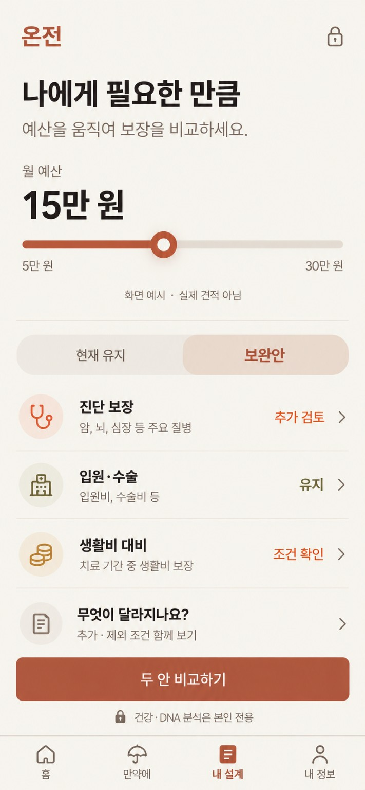
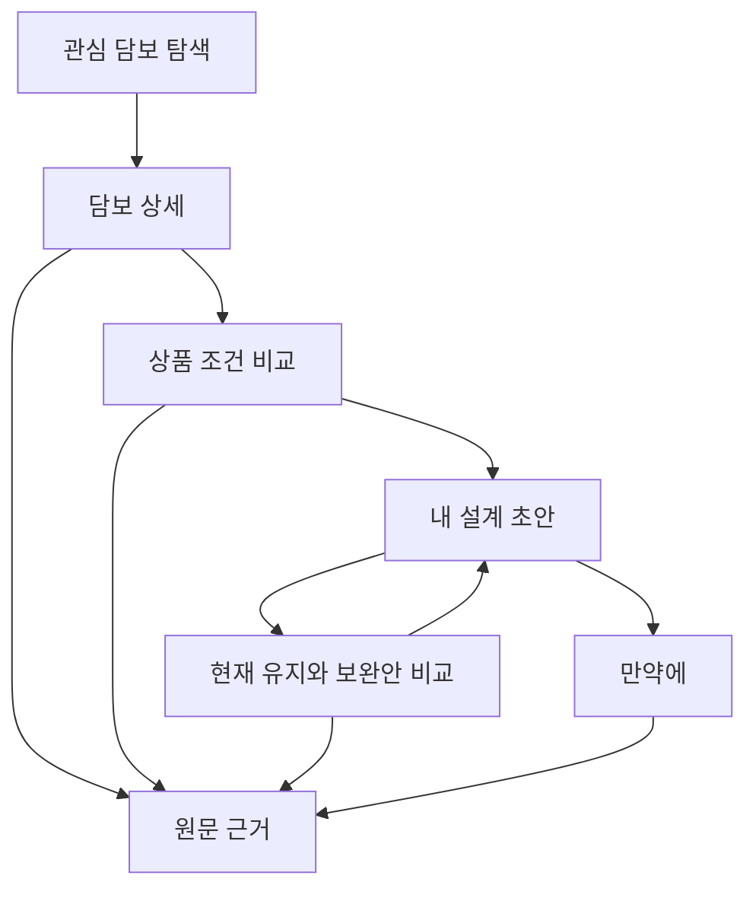

# 온전 소비자 경험 설계 — 나에게 필요한 만큼

2026-10-09 | 구현 명세 초안 | 시각 기준: 사용자가 재지정한 `assets/selected-my-plan.png`

## 1. 제품 약속

소비자가 가격과 보장, 못 받는 조건을 직접 비교하고 선택한다. 판매자의 설명을 검증할 수 있고, 더 가입하지 않는 선택도 할 수 있다. 공개 정보 탐색에는 상담·PDF·건강정보 제출을 요구하지 않는다.

이 이미지가 주 시각 기준이다. 이전 네 화면 보드는 보조 탐색안으로 내린다. 아이보리 바탕, 테라코타, 큰 제목과 숫자, 둥근 슬라이더 손잡이, 동일 크기 선택 탭, 원형 아이콘과 구분선 담보 행, 넓은 CTA를 유지한다. 구조를 상태 대시보드나 카드 격자로 교체하지 않는다.

## 2. 내 설계 화면: 위에서 아래로

| 영역 | 기본 내용 | 조작과 결과 |
|---|---|---|
| 헤더 | 온전 / 본인 전용 잠금 | 잠금 탭: 저장·외부 AI 처리·공유 범위 안내 |
| 제목 | 나에게 필요한 만큼 | 보조 문구: 예산 안에서 보장과 조건을 비교하세요 |
| 예산 | 월 예산 / 사용자가 정한 금액 | 숫자 탭 직접 입력, 슬라이더 조절. 금액은 가격·지급액이 아닌 지출 상한 |
| 가격 기준 | 공시 조건으로 비교 중 / 조건 보기 | 연령·성별·직업 등 실제 사용한 조건과 적용 범위 표시 |
| 선택 탭 | 현재 유지 / 보완안 | 같은 크기·동등한 위계. 기본 현재 유지, 관심 변경사항은 별도 초안 |
| 담보 행 | 진단 보장 / 입원·수술 / 생활비 대비 | 보장 요약과 가장 중요한 제한 한 줄, 탭하면 상세 |
| 차이 행 | 무엇이 달라지나요? | 추가·제외·줄어드는 것·가격 기준 차이를 함께 열기 |
| 주요 행동 | 두 안 비교하기 | 비교 가능한 필드는 비교, 부족한 가격은 별도 표시 |
| 하단 | 건강 분석은 본인 전용 | DNA 구현 전에는 DNA 분석 가능하다는 문구 금지 |
| 내비게이션 | 홈 / 만약에 / 내 설계 / 내 정보 | 내 설계 활성. 탭 전환 시 초안 유지 |

15만 원·5만~30만 원은 시각 예시다. 실제 초기값은 사용자 입력이며 현재 보험료가 확인되면 이를 가져올지 선택한다. 기본 목표를 15만 원으로 강제하지 않는다. 직접 입력으로 범위를 넘길 수 있고 상한까지 쓰도록 유도하지 않는다.

## 3. 예산 슬라이더의 세 가지 동작

| 상태 | 슬라이더를 움직이면 | 화면에서 말하지 않는 것 |
|---|---|---|
| 같은 조건의 공개 가격이 있음 | 해당 조건으로 가격이 확인된 후보를 예산별로 필터링. 보장 차이와 제외 후보 사유 갱신 | 내 확정 보험료, 인수 가능, 전 시장 최저가 |
| 내 조건의 유효한 견적이 있음(후속 기능) | 견적 유효기간·구성을 고정해 예산 내 안을 비교 | 가입 확정·갱신 보험료 보장 |
| 공개 가격이 없거나 조건이 다름 | 예산 저장은 가능. 조건 비교를 계속하고 가격 미확인 후보를 별도 노출 | 가격을 추측하거나 미확인 후보를 예산 초과로 숨기기 |

지출 상한 입력과 실제 상품 가격을 분리한다. 슬라이더는 목표 보장금액을 자의적으로 바꾸지 않는다. 담보를 넣고 뺄 때 가입 가능한 묶음·주계약·특약 종속·공유 할인·최저 가입금액을 검증하며, 이를 모르면 조합 총액을 만들지 않는다.

조작 피드백 목표 150~250ms, 계산 시간은 별도 측정. 최신 입력 해시의 결과만 적용한다. 로딩 중 이전 가격에는 '다시 비교 중' 표시. 결과가 바뀌어도 행이 손가락 아래서 갑자기 이동하지 않게 정렬 갱신을 지연한다.

## 4. 현재 유지와 보완안의 뜻

현재 유지는 사용자의 등록 계약을 바꾸지 않은 기준안이다. 최적이라는 판정이 아니다. PDF가 없으면 '현재 계약을 아직 확인하지 않았어요'와 선택 업로드를 제공하며 관심 담보 비교를 계속할 수 있다.

보완안은 담보를 추가·제외·변경해 살펴보는 사용자 초안이다. 자동 가입 추천이나 해지 실행이 아니다. 새 보장, 사라지는 보장, 면책 재시작, 감액, 가입 조건 미확인, 비용 차이를 같이 표시한다. 원래 계약과 후보의 가격 기준이 다르면 절감액을 계산하지 않는다.

행의 '유지'는 이번 초안에서 변경하지 않았다는 편집 상태, '추가 검토'는 사용자가 선택한 추가 후보, '조건 확인'은 해결할 질문이 있다는 뜻이다. 사용자의 초안 행동은 `plan_action`(keep·add·remove·modify)으로 저장하고, '조건 확인'은 미해결 항목에서 파생하는 `row_label`이다(VOCABULARY.md). AI가 가족력만 보고 추가 가입을 정답으로 지정하지 않는다.

## 5. 연결 화면 설계

| 화면 | 핵심 구성 | 다음 행동 |
|---|---|---|
| 홈 | 내 보험 이해하기 / 관심 담보 / 보장·제외 한 줄 | 계약 없이 탐색 또는 내 설계 |
| 담보 상세 | 무엇을 보장하나 → 언제 못 받나 → 한도·갱신 | 다른 상품과 비교 / 근거 |
| 같은 담보 비교 | 동일 기준 두 열, 질병 정의·면책·감액·한도·가격 조건 차이 강조 | 차이의 원문 보기 |
| 두 안 비교 | 추가되는 것 / 줄어드는 것 / 그대로인 것 / 비용과 미확인 | 초안 저장, 원안으로 돌아가기 |
| 만약에 | 상황 선택, 사용자 가정, 조건부 지급 결과 | 적용 조건·제한·필요 입력 |
| 원문 근거 | 쉬운 설명, 해당 페이지 강조, 적용 버전, 참조 별표 | 원문 전체 / 오류 신고 |
| 내 정보 | PDF·선택 가족력·처리 동의·삭제 | 항목별 수정·철회 |

보장 상세 예시 문구는 합성 픽스처에 한해 “가입 첫 1년에는 진단금의 50%”처럼 쓴다. 실제 화면의 숫자는 해당 버전 원문이 있을 때만 넣는다. 주요 제외를 원문 링크 뒤로 숨기지 않는다.

## 6. 가격·보장 데이터가 화면에 도달하는 계약

화면은 `plan_id`, `input_hash`, `release_id`, `coverage_occurrence_ids`, `premium_observation_ids`, `comparison_basis_id`, `plan_action`, `unresolved_items`를 참조한다. 쉬운 설명은 검증된 필드와 템플릿에서 만들며 계산은 규칙 엔진만 수행한다.

공개 가격 관측치는 `illustrative`, 공개 요율표를 완전히 재현한 금액은 `table_derived`, 개인 견적은 `quoted`, 실제 계약 납입액은 `contract_observed`로 구분한다. 이들은 신뢰 순위가 아니라 서로 다른 근거다. 표 기반 계산이 개인 인수 견적으로 승격되지 않는다.

예산 내 후보에는 해당 비교 기준으로 검증된 금액만 사용한다. 가격 미확인 목록도 같은 비교 흐름에서 접근할 수 있게 한다. 보장 비교와 가격 비교의 가능 범위는 별도다.

## 7. 디자인 전달과 완료 기준

390×844 logical px를 기준으로 구현하고 360px 너비·긴 한글·큰 글자에서 확인한다. 원본 711×1536의 비례를 참고하되 기계적으로 모든 글자를 축소하지 않는다. CTA는 키보드·내비게이션에 가리지 않고 작은 화면에서는 본문 스크롤을 허용한다. 기존 UX_UI_REFERENCE의 색상 토큰을 시작값으로 쓴다.

- 처음 보는 사람이 5초 안에 예산과 보험료를 구별한다.
- 30초 안에 두 안의 얻는 것·잃는 것을 각각 하나씩 설명한다.
- 공개 조건과 개인 조건의 차이를 스스로 찾는다.
- 가격이 없는 상품을 '비싸서 제외된 상품'으로 오인하지 않는다.
- 원문 근거까지 두 번 이내 탭으로 도달한다.
- 예산을 올려도 반드시 더 가입하는 결과가 되지 않는다.
- 가족력·DNA 및 그 파생정보는 광고나 설계사 전달 데이터에 포함되지 않는다.

목표이며 사용성 시험 완료를 의미하지 않는다. 이번 산출물은 화면·상호작용·데이터 설계다. 실행 앱이나 크롤러 구현은 포함하지 않는다.
