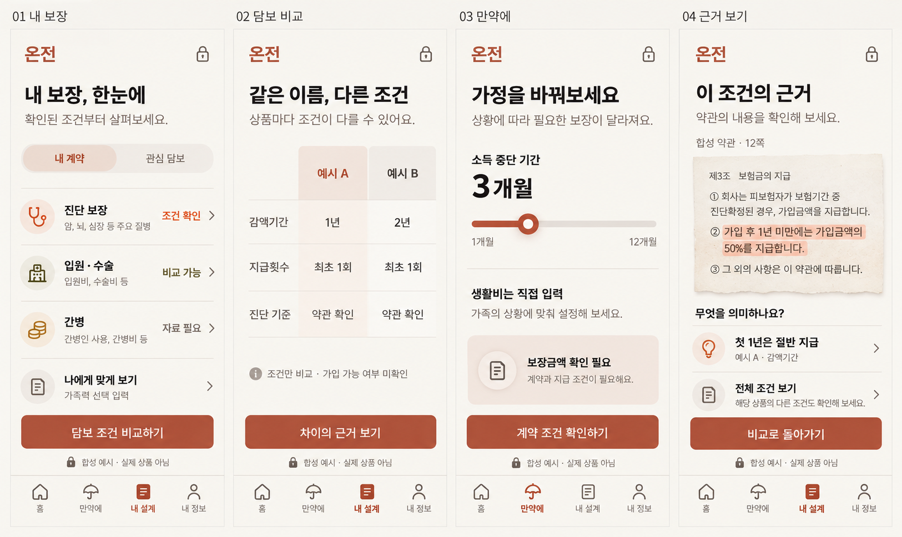

# ONJEON 화면 기준

주 기준: [사용자 재지정 이미지](assets/selected-my-plan.png) · [화면·조작 설계](CONSUMER_FLOW_SPEC.md). 이전 네 화면 견본은 보조 탐색안이다.

- [구현용 UX/UI 명세](UX_UI_REFERENCE.md)
- [선택된 색감·구성 원본](assets/approved-warm-direction.png): 사용자가 선택한 세 번째 구성의 아이보리·테라코타 변형. 공개 가격·예산은 ADR-0010으로 복원했다. DNA는 구현 동결이다.
- [첫 출시 네 화면 견본](assets/coverage-flow-reference.png): 위 무드를 적용한 새 작업 초안. 실제 상품·계약 데이터가 아니다.

이미지는 시각 기준이며 계산·문구·상태 정의는 명세가 우선한다. 새 화면은 사용자 승인 전 작업 초안이다.

상세 부록: [화면·조작 설계서](화면_조작_설계서.md)(시안 실측 치수·색, 조작, 보장·불이익 비교 모델). 상위 명세와 충돌하면 상위 명세가 우선한다.
