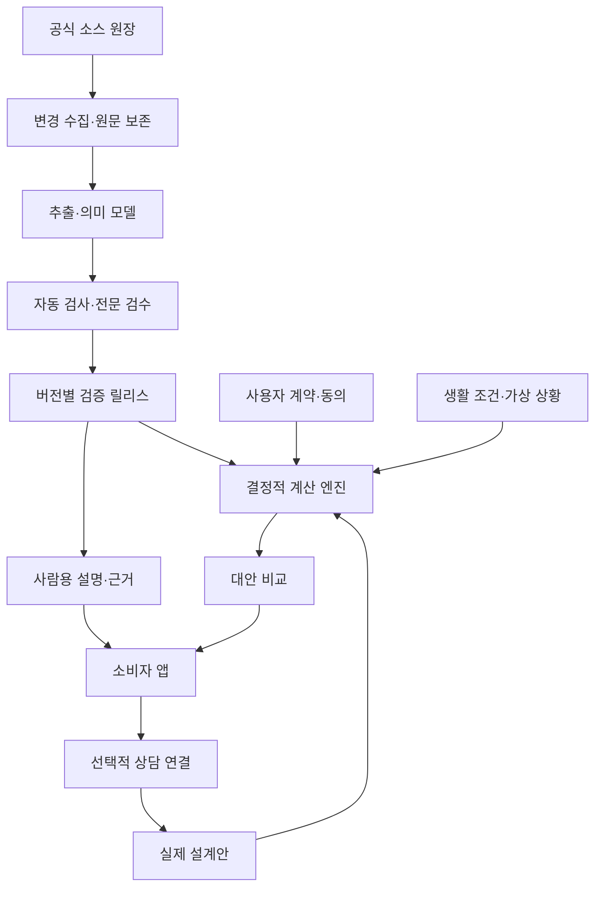

# 온전 ONJEON
## 보험을 이해하는 힘을 소비자에게
### 제품 · 데이터 · 디지털 트윈 · UX 마스터플랜 v0.3

**개정 요약:** 22~41절에 수집·분류·라벨링·검수·실행 규칙의 상세 방법론을 추가했다. 기존 DNA 비공유 원칙을 유지하고 선택한 UX 색감을 반영했다.

- 제1부 1~21절: 제품·UX·아키텍처·개인정보·사업 구조.
- 제2부 22~41절: 크롤링 어댑터·문서 복원·라벨 사전·정답셋·디지털 트윈 컴파일·배포 기준.

2026-10-08 | 한국 시장 우선 | 독립 모바일 앱 + AI API

> 내 삶에 맞는 보장을, 내가 이해하고 선택한다.

가칭 브랜드다. 상표·도메인 검증 전이며 확정 명칭이 아니다. 이 문서는 구현을 위한 설계 제안이다. 실제 데이터 수집, 상품 추천, 인수심사 연계, 규제 적합성 검증을 완료했다는 의미가 아니다. 아래 수치 목표는 개발·운영의 제안 기준이며 측정 실적이나 보장 약속이 아니다. 화면의 인물·계약·금액은 가상 예시로만 사용한다.

---

## 1. 무엇을 만드는가

보험시장의 공시 원문을 지속적으로 수집하고 검증하여, 실행 가능한 보험 조건 모델로 변환한다. 사용자가 자신의 계약과 생활 조건을 넣으면 현재 보장과 부족한 부분을 시각적으로 이해하고 여러 선택을 비교한다. 필요할 때 적합한 등록 설계사와 상담하고, 받은 실제 설계안을 다시 검증한다.

첫 번째 자산은 검증된 보험 조건 데이터다. 두 번째 자산은 원문으로 설명할 수 있는 계산 엔진이다. 세 번째 자산은 사용자가 짧은 시간 안에 이해하는 제품 경험이다.

### 불변 원칙

1. 광고비·모집 수수료는 보험 추천 점수와 상담 품질 점수에 들어가지 않는다.
2. 기존 보험 유지, 추가 가입 없음, 판단 보류도 정상적인 결과다.
3. 추정·확인·미확인은 데이터와 화면에서 구분한다. 미확인은 0원이 아니다.
4. 사람용 요약문을 보험 계산의 입력으로 사용하지 않는다.
5. 모든 보장 판단은 원문 버전·조항·계산 규칙까지 추적할 수 있다.
6. 최신 판매 약관으로 기존 계약을 덮어쓰지 않는다.
7. AI의 자유로운 문장 생성이 지급 조건이나 금액을 결정하지 않는다.
8. 건강·가족력·유전정보를 광고 타기팅과 설계사 순위에 사용하지 않는다. DNA 원문·유전적 취약점·AI 추론·이를 사용한 분석은 본인 전용이며 보험사·설계사에게 전달하는 기능을 만들지 않는다.
9. 소비자가 읽지 않는다는 사실을 화면 설계의 출발점으로 삼되, 중요한 불이익은 숨기지 않는다.
10. 수집 실패, 데이터 부재, 판매 중단은 서로 다른 상태다.

## 2. 제품의 구성

| 영역 | 사용자 | 핵심 기능 | 시점 |
|---|---|---|---|
| 내 보장 | 소비자 | 계약 가져오기·검증·보장 지도 | 초기 |
| 만약에 | 소비자 | 상황별 보장과 생활비 공백 시뮬레이션 | 초기 |
| 내 설계 | 소비자 | 예산별 대안·유지안·전후 비교 | 초기 범위부터 |
| 상담 | 소비자·등록 설계사 | 상품 취급 확인·예약·자료 선택 공유 | 후속 |
| 설계 검증 | 소비자 | 상담 후 실제 제안서 비교 | 후속 |
| 데이터 관제 | 내부 운영자 | 수집 범위·변경·검토·배포·롤백 | 초기 필수 |
| 설명 콘텐츠 | 설계사·소비자 | 근거 연결 아티클·별도 광고 | 후기 확장 |
| 건강 정보 연계 | 소비자·의료 파트너 | 검증된 건강 위험 참고 정보 | 별도 검증 단계 |

## 3. 소비자의 첫 경험

### 3.1 첫 화면에서 할 수 있는 일

가입 강요나 긴 문진보다 먼저 세 가지 진입점을 제공한다.

- 내 보험 살펴보기: 증권·설계안 촬영 또는 파일 업로드.
- 처음부터 준비하기: 예산·가족·관심 상황을 짧게 선택.
- 예시로 둘러보기: 개인정보 없이 가상 가족의 시뮬레이션 체험.

계정 생성은 저장·동기화가 필요할 때 제안한다. 민감정보를 받기 전에는 필요한 동의를 받는다. 기존 대화 기록을 가져오는 ChatGPT 로그인에 의존하지 않으며, 앱의 별도 계정과 서버 측 AI API를 기본으로 한다.

### 3.2 입력 원칙

한 화면에 한 질문. 1차 입력은 가족 구성, 월 예산, 기존 보험 유무, 가장 걱정하는 상황으로 제한한다. 정확도를 높일 질문은 그 답이 결과를 바꾸는 순간에만 추가한다.

파일 인식 후에는 AI가 읽은 내용을 사용자가 확인한다. 이름·주민번호 등 불필요한 항목은 처리 전 가리거나 최소화한다. 가족 구성원은 별도 프로필이며, 성인 가족의 문서·건강정보를 자동 공유하지 않는다.

### 3.3 핵심 화면

| 화면 | 5초 안에 이해할 것 | 기본 행동 | 상세 내용 |
|---|---|---|---|
| 홈 | 내가 가진 보장과 확인할 항목 | 보장 살펴보기 | 계약별 근거 |
| 상황 | 선택한 상황에서 받을 수 있는 보장 | 조건 바꾸기 | 산정 조건·제외 항목 |
| 설계 | 선택에 따른 비용과 보장의 변화 | 대안 비교 | 담보·납입·갱신 조건 |
| 전후 비교 | 더 얻는 것·잃는 것·확인할 것 | 선택 보관 | 원문·견적 기준일 |
| 계약 상세 | 이 계약이 어떤 역할을 하는가 | 보장 조건 확인 | 특약·이력·원문 |
| 상담 연결 | 이 설계안을 누가 상담할 수 있는가 | 한 명 선택 | 취급 범위·후기 |

## 4. UX의 세 층

### 첫 층: 선택

짧은 문장, 큰 금액, 직접 조작, 한 개의 주요 행동. 임의의 건강 점수·보장 점수 87점 같은 숫자는 사용하지 않는다. 보장 금액과 확인 상태처럼 설명 가능한 사실을 보여준다.

### 두 번째 층: 이유

카드나 하단 패널에서 추천 근거, 비용 변화, 중요한 제약을 보여준다. 한 항목은 결론 → 내게 미치는 영향 → 확인할 조건 순서다.

### 세 번째 층: 증거

원문 페이지, 조항, 적용 버전, 계산 경로, 마지막 검증일을 제공한다. 사용자가 깊이 읽을 필요는 없지만 언제든 확인할 수 있다.

### 예시 문구

- “현재 계약으로 확인된 보장이에요.”
- “이 조건은 증권에서 확인하지 못했어요.”
- “월 부담은 줄지만, 보장 종료가 빨라져요.”
- “지금은 추가 가입보다 이 조건을 먼저 확인하세요.”
- “보험사 심사 후 가입 조건이 달라질 수 있어요.”

확정 전에는 “무조건 지급”, “완벽한 보장”, “최저가”, “가입 가능”을 사용하지 않는다. 소비자 화면에서 데이터 파이프라인·벡터 DB 같은 구현 용어는 숨긴다.

## 5. 시각 언어

모바일 중심으로 390×844 기준 화면을 설계한다. 태블릿·웹에서는 동일한 정보 구조를 확장한다. 사용자가 선택한 3번째 화면 구성을 기준으로 한다. 아이보리·차콜·테라코타 색감을 적용하며 세부 토큰은 40절에 기록한다.

- 여백: 4 단위 기본 간격, 화면 좌우 24, 주요 구역 간 32~40.
- 글자: 한국어 가독성을 우선한 단일 UI 서체, 본문 16 전후, 보조 14 이상을 기본값으로 검증.
- 터치: 주요 영역 최소 44×44, 엄지 동선에 주요 행동 배치.
- 색상: 텍스트·아이콘·형태를 함께 사용하여 색만으로 상태를 전달하지 않는다.
- 금액: 월 보험료, 납입기간 총액, 갱신 추정 비용을 혼동하지 않도록 분리.
- 움직임: 조작에 따른 변화와 연결 관계를 설명하는 150~250ms 수준의 짧은 전환. 동작 줄이기 지원.
- 접근성: 큰 글씨, 스크린리더 읽기 순서, 대비, 키보드 사용, 축소 동작을 초기부터 포함.
- 차트: 생활비 공백과 보장 금액처럼 비교 가능한 단위를 사용. 서로 다른 담보를 근거 없이 하나의 점수로 합치지 않는다.

모든 화면을 카드로 채우지 않는다. 정보는 타이포그래피·정렬·간격으로 먼저 구분한다. 분위기는 차분하고 정교하지만 버튼과 조작은 즉시 알아볼 수 있어야 한다.

## 6. 수집 범위와 출처 원장

### 소스 계층

| 계층 | 후보 출처 | 목적 | 한계 |
|---|---|---|---|
| 제도 | 금융위·금감원·법령 | 제도·감독·분쟁 관련 참고 | 상품별 약관 전체의 대체물이 아님 |
| 비교 공시 | 생명·손해보험협회 | 상품 목록·비교·공시 진입점 | 개인별 견적과 구분 |
| 보험사 | 공식 상품공시실 | 약관·특약·사업방법서·요약서 | 누락·동적 페이지·문서 개정 가능 |
| 가격 | 공시 예시·합법적 견적 연계 | 조건별 보험료 | 예시·실견적·추정 구분 |
| 개인 계약 | 사용자 제공 문서·허용된 연계 | 실제 가입 조건 | 인식 및 사용자 확인 필요 |

API가 있으면 우선하고 공개 페이지·파일을 허용된 조건으로 수집한다. 인증·접근제한 우회는 하지 않는다. 비공개 판매 시스템은 별도 계약·권한 확보 대상으로 둔다.

### SourceRegistry

source_id, owner, source_type, canonical_url, access_basis, collection_method, robots_review, usage_terms_review, rate_limit, expected_inventory, freshness_class, last_success_at, last_checked_at, adapter_version, owner_contact, health_state.

접근 가능 여부와 재사용 권한 검토를 분리한다. “공개되어 있다”는 이유만으로 모든 재배포 권한을 가정하지 않는다. 원문 보관·인용·외부 제공 범위는 출처별로 관리한다.

### 범위 증명

보험사 수만 집계하지 않는다. 회사 → 상품 계열 → 판매 채널 → 판매 기간 → 버전 → 주계약/특약/별표의 기대 목록을 만든다. 목록의 완전성 자체가 불확실하면 분모를 ‘확인된 목록’으로 표시한다. 해당 범위를 넘어서 전 시장 완전 수집이라고 광고하지 않는다.

## 7. 크롤링과 변경 처리

1. 소스 등록 및 문서 목록 스냅샷.
2. 조건부 요청·변경 알림이 있으면 활용, 기본 일일 목록 대조.
3. 변경 가능성이 큰 공개 소스는 허용 범위에서 더 짧은 주기로 확인.
4. URL 변경과 실제 내용 변경을 분리하고 해시로 중복 제거.
5. 원문을 불변 저장하고 표·레이아웃·문자·페이지 좌표를 추출.
6. 상품 식별·시기·조항·참조 관계를 복원.
7. 의미 변경을 유형화: 문구 정리 / 지급 조건 / 금액 / 조합 / 판매 상태.
8. 중요 변경은 검수 대기. 검증된 릴리스만 서비스에 배포.
9. 영향을 받는 모델·추천만 재계산. 기존 계약은 계약 조건의 변경이 확인된 경우에만 갱신.

각 작업은 source_id + 원문 해시 + parser_version을 기준으로 중복 실행을 제어한다. 재시도는 지수 지연·횟수 제한·실패 큐를 사용한다. 수집 실패 시 마지막 검증 데이터를 보존하고 최신성 경고를 붙인다.

### 운영 목표안

| 지표 | 초기 목표 | 측정 방식 |
|---|---|---|
| 등록된 정상 소스 확인 간격 | 기본 24시간 이내 | 소스별 마지막 확인 시각 |
| 변경 발견→원문 보존 | p95 15분 이내 | 발견·저장 이벤트 차이 |
| 단순 변경→자동 검증 | p95 60분 이내 | 추출·검증 종료 시각 |
| 중요 변경 | 검수 SLA 별도, 미검증 배포 금지 | 대기시간·적체 규모 |
| 공개된 계산 규칙 원문 연결 | 100% | 누락 검사 |
| 출시 핵심 시나리오 | 전문가 승인 테스트 전부 통과 | 고정 테스트셋 |

24시간 확인은 24시간 내 공개 시점을 안다는 의미가 아니다. 소스 장애·게시 시각 부재·수동 검토는 별도 상태와 경과 시간으로 공개한다. 초기 목표는 실제 소스 수·문서량·검수 인력 측정 후 조정한다.

## 8. 한 원문에서 두 개의 결과

원문 → 검증된 의미 모델 → AI 실행 데이터와 사람 설명을 분기한다. 두 결과는 같은 clause_id와 model_release_id를 공유한다.

### AI 실행 데이터

담보 정의, 지급사유, 진단·시술 코드 및 버전, 피보험자 조건, 보장 기간, 대기·감액 기간, 제외 조건, 금액 단위, 계산식, 횟수·누적한도, 타 담보와의 관계, 적용 우선순위, 근거 페이지, 검증 상태를 포함한다.

### 사람 설명

한 줄 설명, 받을 수 있는 대표 상황, 받을 수 없는 주요 상황, 필요한 확인 정보, 내 계약에의 적용 여부, 원문 보기로 구성한다. 생성된 설명의 모든 사실 문장은 원문 또는 검증 규칙에 연결한다.

### 자동화와 검수

추출 모델과 검증 모델의 역할을 분리하되, 모델끼리 동의했다는 이유만으로 정답으로 처리하지 않는다. 숫자·날짜·단위는 규칙 검사, 참조 누락은 그래프 검사, 중요 지급 조건은 도메인 전문가 검수로 보완한다. 정답셋과 모델·프롬프트·파서 버전을 고정하여 회귀 검증한다.

## 9. 정규 데이터 모델

| 엔터티 | 주요 내용 |
|---|---|
| Insurer / ProductFamily | 보험사·상품 계열 식별 |
| ProductVersion | 채널·판매 기간·적용 조건·문서 묶음 |
| SourceDocument / Clause | 해시·페이지·좌표·원문·참조 |
| CoverageDefinition / Rule | 담보 의미·조건·계산·예외 |
| CombinationConstraint | 필수 주계약·동시 가입·금액 제약 |
| PremiumObservation | 예시/견적/추정 구분·입력 조건·기준 시각 |
| PersonalPolicy / Endorsement | 가입 시점·선택 담보·계약 변경 |
| HouseholdProfile | 최소한의 가족·재정 조건 |
| Scenario / Simulation | 가정·규칙 버전·결과·미확인 |
| Recommendation | 후보 집합·제약·선택 이유·제외 이유 |
| Evidence / Review / Release | 검증 주체·판정·릴리스·롤백 |
| Consent / AccessGrant | 목적·범위·수신자·만료·철회 |

기간은 업무상 적용 시각(valid time)과 시스템이 알게 된 시각(recorded time)을 모두 저장한다. 판매 시작일, 계약 체결일, 보장 개시일, 수집일을 하나의 날짜로 합치지 않는다.

담보 표준화는 원문 식별자를 보존한 채 의미 관계를 추가한다. 유사·동일·부분 포함·비교 불가를 구분하고, 상품 이름만으로 병합하지 않는다.

## 10. 보험 디지털 트윈

이 프로젝트의 디지털 트윈은 보험 조건과 개인 계약을 실행 가능한 상태로 재현하는 모델이다. 인체나 미래를 완벽하게 예측하는 모델을 의미하지 않는다.

### 네 모델

- 상품 모델: 판매 버전·담보·제약·가격 근거.
- 계약 모델: 본인이 실제 가입한 담보와 이후 변경.
- 생활 모델: 부양가족·고정지출·소득·비상자금·선호.
- 상황 모델: 사용자가 선택한 가상 사건·기간·비용·진단 조건.

### 실행 원칙

조건식은 충족/불충족/판단불가의 세 값으로 평가한다. 핵심 입력이 없으면 추가 질문 또는 범위를 반환한다. 실손형·정액형, 자기부담·비례보상, 중복 지급, 통산 한도 등을 담보 규칙에 따라 계산한다. 상품군별 다른 처리 순서를 한 공식에 억지로 넣지 않는다.

금액 계산은 소수점·반올림 규칙을 명시한 결정적 계산기를 사용한다. LLM은 입력을 정리하고 설명하지만 금액을 임의 생성하지 않는다. 임의 코드 실행 대신 허용된 선언형 규칙을 사용한다.

### 결과 계약

결과는 예상 지급액 또는 조건부 범위, 확인된 제외 항목, 입력 가정, 부족한 정보, 해당 원문, 사용한 모델 버전, 보험사 판단이 필요한 부분을 포함한다. 계산 조건이 성립하지 않으면 추정 금액을 크게 보여주지 않는다.

### 재현성

입력 스냅샷 + 계약 버전 + 규칙 릴리스 + 계산기 버전으로 결과를 다시 만들 수 있어야 한다. 변경 전후 결과 차이와 원인을 저장한다. 잘못된 릴리스를 되돌려도 당시 사용자에게 보여준 기록은 보존한다.

## 11. 추천은 판매량 최적화가 아니다

후보 생성 → 가입 조건의 확인 가능 범위 필터 → 기존 보장 고려 → 비용·보장 공백 평가 → 지배되는 대안 제거 → 2~3개 대안 설명의 순서다.

목적은 ‘소비자가 감당하기 어려운 손실을 예산 안에서 줄이는 것’이다. 광고 수익·설계사 수수료·가입 전환율은 추천 목적함수에 포함하지 않는다.

필수 제약: 예산, 실제 조합 제약, 근거 최신성, 보장 목표, 사용자의 선호. 실제 견적이 없으면 가격을 예시 또는 미확인으로 표시한다. 최적이라는 주장은 확인된 후보 범위 안으로 제한한다.

유지안·최소 보완안·확대안 등을 비교하되 모든 사용자에게 가입 대안 세 개를 억지로 만들지 않는다. 갱신 보험료는 확정 총액으로 표시하지 않고 가정별 시나리오를 제공한다. 계약 교체에는 보장 공백·면책 재시작·인수 불확실성·해지 손실을 반영한다.

## 12. 가족력·건강정보·유전정보 확장

가족력은 선택 입력이다. 친족 관계·질환·발병 연령대·정보 확실성을 최소한으로 받으며, 가족 실명과 불필요한 상세 병력은 요구하지 않는다. 가족력 없음과 모름을 구분한다.

질환 위험 추정과 보험 필요성 평가는 별도 계층이다. 검증된 근거 없이 개인의 발병 확률을 생성하지 않는다. 의료 위험만으로 고액 담보를 권하지 않고 기존 보장과 가계 손실을 함께 고려한다.

유전정보 모듈은 사용자가 명시한 정식 설계 범위다. 기능과 데이터 경계를 지금 설계하고, 실제 제공은 법적·임상 검증을 통과한 범위에서 단계적으로 활성화한다. 검사 종류·검사기관 해석·근거 수준·인구집단 적합성·동의·허용 목적을 검증해야 한다. 유전정보를 보험 차별에 사용하는 것과 검사·결과 제출 강요는 국내 법적 제약이 있다. 본인을 위한 자발적 분석의 구체적 허용 범위도 별도 검토한다.

원시 DNA·유전적 위험 추론·관련 질문과 설명·유전정보 기반 설계 결과를 설계사, 보험사, 광고 시스템에 전달하지 않는다. 자동·수동·동의 기반 공유 기능 모두 제공하지 않는다. 일반 보험 데이터와 저장·권한·로그를 분리한다. 가족력만으로 유전정보 차별 관련 검토가 불필요하다고 단정하지 않는다. 의료 판단을 표방하는 기능은 의료기기 등 해당 규율 검토를 별도 출시 조건으로 둔다.


### 12.1 DNA 연계의 사용자 여정

1. 사용자가 ‘나만의 건강·보장 분석’을 선택한다. 외부 유전자검사 서비스 안내를 둘 수 있으나 검사 구매·결과 제출을 강요하지 않는다. 네뷸라 지노믹스는 사용자가 제시한 예시 후보이며 현재 이용 가능 여부를 확인한 추천 업체가 아니다. 실제 목록은 제공 지역·검사 범위·의료적 해석·데이터 보관·삭제·재사용 정책을 확인한 후 게시한다.
2. 사용자가 외부 서비스에서 받은 본인의 결과 또는 의료기관 판독 자료를 별도 동의 후 직접 가져온다. 초기 기본 경로는 사용자 주도 파일 가져오기이며 외부 업체의 자동 전송·보험사 제휴 수집을 전제하지 않는다.
3. 검사기관·검사일·검사 종류·본인 결과 여부를 확인한다. OCR 결과와 의료기관 해석을 구분한다.
4. 의료기관의 판독·유전상담 내용을 기준으로 확인된 사실과 불확실한 의미를 정리한다. 불확실한 변이를 자동으로 고위험으로 분류하지 않는다.
5. 가족력·기존 진단·생활 조건과 겹치는 증거를 확인한다. 가족력과 유전점수를 단순 합산하지 않는다.
6. 근거가 허용하는 범위에서 보장 점검 항목을 제시한다. DNA만으로 상품이나 가입금액을 단정하지 않는다.
7. 사용자가 원하는 상황을 선택하여 기존 보장·비용·소득 중단 시나리오와 대조한다.
8. DNA 분석 공간에서는 설계사 공유·상담 전달 기능을 제공하지 않는다. 일반 상담 흐름은 별도 입력으로 시작하며 DNA 결과·파생 정보·선택 이유·DNA를 사용한 설계안을 가져오지 않는다.

### 12.2 DNA 데이터 모델

GeneticReport: report_id, subject_ref, issuing_institution, report_date, specimen_date_if_present, test_type, laboratory_method, report_hash, clinical_interpretation_ref, extraction_status.

GeneticFinding: finding_id, report_id, gene_or_marker, variant_notation_if_present, classification, associated_condition, interpretation_date, evidence_level, laboratory_comment, clinician_review_status. 검사에 없는 항목은 만들어 채우지 않는다.

RiskEvidence: evidence_id, source_kind, population, age_range, endpoint, time_horizon, absolute_or_relative_risk, estimate, uncertainty, validation_reference, model_version. 비교 집단·기간·분모 없이 상대위험을 개인의 절대 발병확률로 바꾸지 않는다.

HealthCoverageBridge: evidence_ref, coverage_topic, clinical_review, legal_use_status, user_intent, rationale, uncertainty, source_clauses. 의료적 관련성과 보험 약관상 지급사유의 일치를 별도로 확인한다.

GeneticConsent: 목적·자료 종류·수신자·기간·철회·재분석 동의. 단순 서비스 동의나 마케팅 동의에 묶지 않는다.

### 12.3 해석과 실행 경계

단일유전자 질환 관련 검사, 종양의 체세포 검사, 생식세포 검사, 다유전자 위험점수, 보인자 검사, 약물유전체 검사 등을 구분한다. 서로 다른 검사를 하나의 ‘유전 위험점수’로 환산하지 않는다. 미확정 변이(VUS), 병원 해석 부재, 집단 적합성 부족은 추천 강화의 근거로 사용하지 않는다.

DNA 분석이 없는 보험 트윈과 DNA 참고 정보가 있는 트윈을 비교할 수 있도록 한다. 무엇이 바뀌었고 그 근거가 무엇인지 공개한다. 의학적 위험을 제시하는 기능은 검증된 모델·전문가 책임 범위·필요 인허가 여부를 출시 전에 확인한다. LLM에 원시 DNA를 넣어 자체 판독시키는 기능은 설계하지 않는다.

### 12.4 소비자 화면

‘외부 검사 서비스 알아보기’ → ‘내 결과 가져오기’ → ‘AI에게 질문하기’ → ‘나만 보는 보장 분석’의 세 화면을 기본으로 한다. 질환마다 검사결과의 의미, 확실하지 않은 부분, 보장 관련 확인사항을 분리한다. 정상·안전 같은 과도한 확언이나 공포를 유발하는 붉은 위험 순위를 피한다.

초기 입력은 사용자가 이미 보유한 결과와 해석을 중심으로 한다. 소비자용 검사 결과와 임상적으로 확인된 결과를 명확히 구분하며, 확인이 필요한 결과는 위험을 확정하거나 가입을 강화하는 근거로 쓰지 않는다. 원시 유전체 파일 수집은 목적·필요성·검증 체계가 확보된 경우에만 별도 검토한다. 초기에는 수집하지 않아도 이 연계의 사용자 가치는 구현할 수 있다.

### 12.5 DNA 전용 검증 게이트

검사 유형 오분류, 다른 사람의 보고서, 소수점·유전자 기호 OCR 오류, 병적 변이와 VUS 혼동, 상대위험과 절대위험 혼동, 서로 다른 집단 적용, 체세포와 유전성 소인 혼동, 검사 해석 개정, 철회 후 재사용, 가족 구성원 권한 혼합을 검사한다.

법적 허용 범위가 확인되지 않은 분석·추천은 비활성 상태를 유지하되, 별도 기능으로 설계·검증한다. 사용자 동의가 차별 금지나 검사 강요 금지를 면제하지 않는다. 보험사 고지의무 질문은 임의로 회피하도록 안내하지 않고 해당 질문과 적용 법리를 별도 검토한다.


### 12.6 본인 전용 정보 경계 — 사용자 확정 요구

DNA 원문뿐 아니라 유전적 취약질환, 상대·절대위험 추정, AI 질문·답변, 가족력 결합 결과, 보장 우선순위의 유전적 근거, DNA를 사용해 만들어진 설계 결과에도 genetic_private 표식을 상속한다. 식별자를 지운다고 설계사에게 전달 가능한 자료로 바뀌지 않는다.

수신자 보험사·설계사·GA·광고 서비스에 대해서는 해당 표식이 있는 결과의 내보내기·API 접근·알림·분석 이벤트 전송을 차단한다. 별도 동의를 받아 풀어주는 우회 기능을 제공하지 않는다. 검토·지원 담당자도 기본 접근 권한을 갖지 않으며 원문을 일반 운영 로그에 기록하지 않는다.

일반 상담에 쓰는 데이터와 본인 전용 분석은 저장·검색·캐시·세션 문맥을 분리한다. 외부 상담용 설계안을 생성할 때는 DNA 정보를 제외한 입력으로 새로 계산하고, DNA 기반 결과에서 복사하지 않는다. 사용자의 수동 행동까지 완전히 통제한다고 주장하지는 않되 앱이 정보 유출 경로를 만들지 않는다.

AI API를 사용하면 선택한 정보가 처리 제공자에게 전송될 수 있으므로 ‘본인만 확인’이라는 열람 정책과 외부 처리 사실을 구분해 설명한다. 외부 AI 처리 동의, 최소 필드 전송, 학습 미사용·보존 조건 확인을 요구하며, 원본 유전체 파일 전송은 기본적으로 사용하지 않는다. 동의하지 않으면 해당 외부 AI 분석을 실행하지 않는다. 종단간 암호화·제로 지식처럼 구현되지 않은 보안 수준을 주장하지 않는다.

기능 게이트에는 원문·파생 데이터의 교차 계정 접근, 설계사 API, 상담 첨부, 검색 색인, 광고 이벤트, 오류 로그, AI 대화 문맥으로의 누출 테스트를 포함한다. 이 테스트가 통과하지 않으면 DNA 분석을 출시하지 않는다.

## 13. 시스템 구성

모바일 클라이언트와 내부 관제는 동일한 검증 릴리스 API를 사용하되 권한을 분리한다. 데이터 수집망은 개인 민감정보 저장 영역과 분리한다.



### 초기 기술 경계

- 관계형 DB: 상품 버전·규칙·계약·동의·검수·릴리스의 권위 데이터.
- 객체 저장소: 불변 원문·페이지 이미지·추출 중간 결과.
- 검색 색인: 전문 검색·의미 검색. 검색 결과를 계산의 권위 데이터로 쓰지 않는다.
- 작업 큐: 수집·추출·검토·재계산의 상태·재시도·중복 제어.
- 규칙 엔진: 결정적 금액 계산·조건 판정·실행 이력.
- AI 게이트웨이: 추출·설명·질문 생성, 구조화 출력 검증, 비용·모델 버전 추적.
- API: 모바일·설계사·관제의 역할별 접근 제어.

처음에는 모듈 경계가 분명한 단일 백엔드와 별도 워커로 시작한다. 확장 요구가 실제 발생하면 수집·추출·시뮬레이션을 독립 서비스로 분리한다. 특정 클라우드나 DB 공급자는 아직 확정하지 않는다.

### 개념 API

POST /policy-imports, GET /policy-imports/{id}, POST /policies/{id}/confirm,
POST /simulations, GET /simulations/{id}/evidence,
POST /plan-comparisons, POST /consultation-requests,
GET /products/{id}/versions, GET /data-coverage,
POST /reviews/{id}/decisions, POST /releases/{id}/publish.

민감정보 쓰기에는 권한·동의·멱등성 검사, 결과 조회에는 소유권 검사, 검증 릴리스에는 승인 기록을 요구한다. 상담 연결 API는 규제·운영 검증 후 활성화한다.

## 14. 데이터 관제 화면

초기부터 필요한 내부 제품이다. 소비자 앱이 아름다워도 관제가 없으면 신뢰가 유지되지 않는다.

- 범위 지도: 보험사·상품군·버전별 확보/누락/미확인.
- 소스 상태: 마지막 확인·성공·실패 이유·다음 처리.
- 변경함: 지급 조건 변경을 숫자·문구 차이와 원문 페이지로 표시.
- 검토함: 근거 충돌·별표 누락·참조 단절·단위 오류.
- 영향 분석: 변경 규칙을 사용하는 상품·설계·시뮬레이션 수.
- 배포함: 릴리스 변경 요약·테스트·승인·롤백.
- 품질 화면: 필드별 오류·미해결 중요 건·검수 적체·비용.

## 15. 보안과 오류 대응

수집 문서는 신뢰할 수 없는 입력으로 취급한다. PDF 속 지시문이나 URL을 시스템 명령으로 실행하지 않는다. 외부 링크 탐색은 출처 허용 범위와 작업 권한을 적용한다.

개인 문서와 공시 원문은 저장 영역·접근 권한을 분리한다. 로그에 원문 건강정보를 남기지 않는다. 암호화·목적별 동의·접근 이력·삭제·보존기간을 설계한다. AI 제공자에게 보내는 필드를 최소화하고 보관·학습·국외이전 조건을 실제 계약과 설정으로 확인한다.

잘못된 보장 설명이나 계산을 발견하면 해당 규칙의 신규 추천을 중단하고, 영향 범위를 확인하고, 수정 릴리스와 사용자 안내를 남긴다. 이미 보여준 잘못된 결과를 조용히 덮어쓰지 않는다.

## 16. 설계사 연결·평가·수익

설계사 또는 GA의 등록·소속·상품 취급 가능 범위를 확인한다. 설계안을 상담할 수 있는 후보만 제시하고 소비자가 한 명을 선택한다. 연락처와 문서는 선택한 범위만 공유한다.

상담 완료 후기와 가입 여부를 분리한다. 설명 충실도·요구 준수·영업 압박·약속 이행을 평가한다. 후기 수·최근성을 반영하고 소수 후기의 과도한 상위 노출, 허위 후기, 보복 평가에 대한 절차를 둔다. 단순 별점이 실제 보험 적합성을 보장한다고 표현하지 않는다.

기본 사업 가설은 설계사 도구 구독과 명시적 광고 영역이다. 광고비는 자연 순위·후기·상품 추천에 영향을 주지 않는다. 성사 수수료·리드 과금은 별도 법적 검토 대상이다. 정액 광고비라는 명칭이나 외부 계약 체결만으로 중개 규제를 피한다고 전제하지 않는다.

## 17. 검증 계획

### 핵심 정답셋

면책 기간 하루 전·당일·다음 날, 감액 종료 경계, 같은 질환의 정의 차이, 특약 필수 조합, 지급 횟수 소진, 계약 변경 전후, 실손 중복, 누락된 가입금액, 잘못 읽은 금액 단위, 판매중단과 소스 장애를 포함한다.

### 출시 게이트

- 선언한 상품 범위의 문서·참조 관계를 전수 점검.
- 게시하는 규칙과 설명의 원문 연결 누락 0건.
- 출시 핵심 테스트셋 전부 통과, 중요 미해결 오류 0건.
- 입력 부족 시 판단불가 반환을 검증.
- 릴리스 롤백과 재현성 검증.
- 건강정보·가족 프로필·상담 공유 권한 분리 검증.
- 추천·광고·상담 흐름의 법적 검토 완료 범위만 활성화.

### UX 검증 목표안

가상 계약으로 사용성 시험을 진행한다. 사용자가 5초 안에 화면 목적을 파악하고, 30초 안에 두 안의 가장 큰 이득·불이익을 설명할 수 있는지 확인한다. 클릭 수뿐 아니라 잘못 이해한 비율을 측정한다. 처음 8~12명은 문제 발견용으로 사용하고, 이를 전체 사용자 성능의 통계적 증명이라고 부르지 않는다.

## 18. 단계별 로드맵

기간은 인력·소스 접근성 확인 전의 가설이며, 날짜보다 통과 조건으로 진행한다.

| 단계 | 결과물 | 다음 단계 조건 |
|---|---|---|
| A. 기준 설계 | 소스 원장·스키마·상태 모델·핵심 화면 | 용어·범위·근거 계약 합의 |
| B. 첫 완성 흐름 | 한 보험군, 3개 보험사 목표, 실제 공시 수집부터 화면까지 | 문서 확보·계산·설명 검증 |
| C. 개인 계약 | 증권 추출·사용자 확인·계약 트윈 | 버전 매칭과 미확인 처리 검증 |
| D. 시장 확장 | 상품군별 어댑터·변경 감지·운영 관제 | 품질과 검수 처리량 유지 |
| E. 상담 연결 | 등록 설계사·예약·후기·제안 재검증 | 법적·개인정보·운영 검토 |
| F. 콘텐츠·수익 | 업무 구독·광고·아티클 | 추천 독립성 검증 |
| G. 건강 확장 | 검증된 가족력·건강 위험 보조 | 임상·법적 검증, 차별 방지 |
| H. DNA 검사 연계 | 병·의원 결과 수신·의료 해석·보장 대조·시나리오 | 독립된 허용 범위·임상 검증·출시 게이트 |

첫 보험군 후보는 정액형 진단 담보다. 조건과 예외가 비교적 명시적인 흐름부터 검증하되, 상품·자료 조사 후 최종 선정한다. 처음부터 전 상품의 완벽한 계산을 주장하지 않는다.

### 초기 팀 역할

데이터 수집·운영, 보험 도메인 검수, 계산·백엔드, 모바일·인터랙션, 제품 디자인, 개인정보·규제 검토 역할이 필요하다. 한 사람이 여러 역할을 맡더라도 중요 규칙의 작성과 승인은 분리한다.

### 비용 산식

월 운영비 = 변경 문서 수×평균 추출 비용 + 검수 시간×인력 단가 + 활성 사용자×분석 빈도×호출 비용 + 저장·검색·네트워크 + 지원·보안 운영비.

전체 문서를 매일 재추출하지 않는다. 해시 중복 제거·변경 부분 재처리·검증 결과 재사용으로 비용을 통제한다. 소스 수와 문서량을 측정하기 전 고정 비용 견적을 제시하지 않는다.

## 19. 측정할 성과

- 데이터: 소스 확인 지연, 변경 처리 지연, 누락, 필드별 오류, 원문 추적률.
- 계산: 전문가 판정 일치, 판단불가의 적절성, 중요 오류, 재현성.
- 소비자: 핵심 조건 이해, 전후 차이 이해, 예산 내 보장 공백 개선.
- 상담: 요청 준수, 불필요한 영업 경험, 제안 변경 이유 설명.
- 사업: 도구 유료 전환·유지율·광고 수익, 추천 독립성과 별도 관리.

절감액은 동일하거나 명시적으로 다른 보장 조건을 비교한 경우에만 산출한다. 추정 절감과 실제 변경 후 절감을 분리한다. 보험료를 낮춘 모든 경우를 소비자 이익으로 집계하지 않는다.

## 20. 결정 기록

### 이번 설계의 기본값

독립 앱 + AI API / 모바일 우선 / 소비자 중심 / 공시 전수화 지향 / AI와 사람 설명 분리 / 결정적 계산 / 버전과 근거 추적 / 상담·광고·콘텐츠 후속.

### 구현 전 결정할 항목

가칭 명칭, 첫 보험군과 소스 범위, 실견적 확보 방식, 검수 책임자, 개인정보 보관 범위, 상담·추천의 허용 사업 구조. 이 결정이 데이터 원장·원문 수집 조사와 시각 탐색을 막지는 않는다.

### 이번 산출물의 범위

제품·아키텍처·데이터·검증·운영·UX 설계와 시각 콘셉트다. 앱 코드, 운영 크롤러, 실제 상품 데이터베이스, 배포, 정기 실행은 아직 만들거나 켜지 않았다.

## 21. 확인한 1차 자료와 근거의 범위

2026-10-08 대화 중 확인한 공식 자료를 설계의 출발점으로 사용했다. 아래 자료는 상품 전수 확보나 현 사업모델의 적법성을 증명하지 않으며, 규제 자료의 발표 시점과 실제 출시 시점의 적용 기준을 구분해야 한다.

- KB손해보험 공시이용 매뉴얼: 약관·사업방법서·상품요약서 공시 구조. https://www.kbinsure.co.kr/m/CG802010001.ec
- 삼성화재 상품공시: 판매상품별 문서 목록. https://samsungfire.com/vh/page/VH.HPIF0103.do
- 손해보험협회 자동차보험 상품 비교공시: 공시와 개인별 정확한 보험료의 구분. https://kpub.knia.or.kr/carInsuranceDisc/product/carProductInf.do
- 금융위 금융통계생명보험정보: 회사·영업 통계의 범위. https://www.data.go.kr/data/15061306/openapi.do?recommendDataYn=Y
- 금융위 온라인 금융플랫폼 적용사례(2021): 중개·상담 연결 판단 참고. https://www.fsc.go.kr/po010101/76485
- 금융위 법령해석 3668: 보험상담 연결 플랫폼 광고 관련. https://better.fsc.go.kr/fsc_new/replyCase/LawreqDetail.do?lawreqIdx=3668&muGpNo=75&muNo=171&stNo=11
- 생활법령정보: 유전정보 처리·차별·검사 강요 제한. https://www.easylaw.go.kr/CSP/CnpClsMain.laf?ccfNo=5&cciNo=1&cnpClsNo=1&csmSeq=1702&menuType=cnpcls&popMenu=ov
- NHGRI Genetic Testing FAQ: 유전자검사 해석의 한계. https://www.genome.gov/FAQ/Genetic-Testing
- NHGRI Family History: 가족력의 위험 평가상 의미. https://www.genome.gov/genetics-glossary/Family-History

---

온전의 약속: 소비자가 복잡한 약관을 모두 읽지 않아도, 무엇을 선택하는지는 이해할 수 있게 만든다.
# 제2부. 데이터 수집·라벨링·검증 실행 명세

v0.3 추가 | 2026-10-08 | 6~10절과 14·17절의 구현 기준

이하 내용은 개발할 시스템의 요구사항과 제안한 초기 검증 기준이다. 실제 보험사 전수 목록 조사, 크롤러 실행, 약관 정답셋 구축, 성능 측정은 아직 하지 않았다. 기술 선택지는 후보이며 한국어 보험 문서에 대한 시험 결과로 확정한다. 제1부와 세부 기준이 충돌하면 이 제2부의 기준을 적용한다.

## 22. 수집에서 배포까지의 책임 경계

문서를 확보했다고 상품 전체를 이해한 것은 아니다. 한 페이지에서 지급 금액을 찾았어도 별표의 제외 조건을 찾지 못했다면 해당 담보는 계산에 사용할 수 없다.

| 단계 | 입력 | 산출물 | 완료 조건 | 실패 시 담당 |
|---|---|---|---|---|
| 발견 | 공식 출처·목록·참조 링크 | 소스·상품 후보 원장 | 조회 범위와 발견 경로 기록 | 수집 운영 |
| 확보 | 다운로드 후보 | 원문·응답 증거·해시 | 실제 파일과 전체 페이지 확인 | 수집 개발 |
| 식별 | 원문·목록 메타데이터 | 상품·버전·문서 묶음 | 식별 근거 일치, 충돌 격리 | 데이터 운영 |
| 복원 | PDF·HTML·이미지 | 구조화 문서 | 본문·표·각주·순서 복원 | 문서 처리 |
| 라벨링 | 구조화 문서 | 조항·담보·관계·필드 | 필드별 근거와 상태 존재 | 보험 데이터 담당 |
| 검증 | 라벨·참조·원문 | 승인 또는 보류 | 주요 조건 검수와 참조 완결 | 독립 검수자 |
| 규칙화 | 승인된 의미 모델 | 실행 규칙·설명 | 경계값 테스트와 설명 검증 | 계산 엔진 담당 |
| 배포 | 검증 묶음 | 불변 릴리스 | 범위·변경·승인·복구 기록 | 릴리스 담당 |

작성자와 승인자를 구분한다. 모델 B가 모델 A의 출력을 확인하는 작업은 사람의 독립 승인과 같지 않다. 인력이 부족하면 공개 범위를 줄이며, 검토되지 않은 담보를 자동 승인하지 않는다.

## 23. 전수 수집의 분모 만들기

### 23.1 조사 단위

회사 → 상품군 → 판매 상태 → 채널 → 판매 기간 → 상품 버전 → 주계약·특약 → 별표·부속서 순서로 목록을 관리한다. 회사 하나를 수집 성공으로 표시해도 하위 문서 확보율을 별도 표시한다.

출처는 다음 경로를 교차 확인한다.

1. 공식 보험사·협회 목록에서 조사할 회사를 정한다. 생명·손해·기타 제도상 구분을 보존한다.
2. 보험사 공식 공시실에서 현재 판매와 판매 중지, 다이렉트와 다른 판매 채널, 이전 상호·도메인의 공개 이력을 확인한다.
3. 협회 비교공시와 회사 상품 목록을 대조해 한쪽에만 있는 상품을 차이 목록으로 만든다.
4. 개별 상품의 다운로드 목록과 문서 목차에서 예상 주계약·특약·별표를 추출한다.
5. 본문이 참조한 다른 문서·별표를 따라가 확보 여부를 대조한다.

일반 검색 결과는 빠진 공식 페이지를 찾는 탐색 수단이다. 검색 결과 수를 보험상품 전체 수로 사용하지 않는다. 공식 목록도 불완전할 수 있으므로 조사 범위 밖의 누락 가능성은 별도 남긴다.

### 23.2 목록 조회의 완결 조건

페이지네이션·더 보기·연도 필터·판매 상태 필터·상품군 필터를 모두 조사하여 query_matrix를 만든다. 중복 조합은 기록 후 제거하되 조회를 생략했다는 사실을 숨기지 않는다.

페이지마다 query_signature, cursor_or_page, item_count, advertised_total, first_item_id, last_item_id, page_hash, next_pointer, fetched_at을 저장한다. 마지막 페이지 도달·고유 항목 합계·공시된 전체 건수의 일치를 확인한다. 총 건수가 없는 경우 종료 근거를 기록한다. 같은 마지막 페이지가 반복돼도 성공으로 종료하지 않는다.

목록 수집 도중 신규 게시물이 추가되면 항목이 밀려 누락될 수 있다. 시작과 종료의 목록 지문을 대조하고, 변동이 확인되면 겹치는 구간 또는 해당 목록 전체를 다시 확인한다. 목록 정렬 조건도 고정한다.

### 23.3 상품별 기대 문서 장부

ExpectedDocument에는 다음을 기록한다.

- product_candidate_id, document_role, expected_from, evidence_ref.
- expected_label, optionality, discovery_state, asset_id_if_resolved.
- missing_reason, first_missing_at, last_checked_at, owner, followup_status.

문서 역할은 약관·주계약·특약집·사업방법서·요약서·가격 예시·개정 공지·별표로 구분한다. 보험군마다 적용되는 목록이 다르므로 모든 상품에 동일한 문서 세트를 강요하지 않는다. 특약집 한 PDF 안에 별표가 있으면 별도 파일이 없어도 문서 내부 근거로 충족할 수 있다.

### 23.4 확보율은 층별로 표시한다

| 지표 | 분자 / 분모 | 주의점 |
|---|---|---|
| 목록 조회율 | 완료한 조회 조합 / 등록된 조회 조합 | 분모 조사일도 표시 |
| 원문 확보율 | 확보된 기대 문서 / 확인된 기대 문서 | 기대 문서 미발견은 별도 집계 |
| 조항 처리율 | 처리 상태가 부여된 조항 / 식별된 전체 조항 | 제외한 조항도 이유 필요 |
| 참조 해결률 | 해결된 필수 참조 / 발견한 필수 참조 | 외부·과거 버전 참조 포함 |
| 실행 가능률 | 승인된 담보 버전 / 발견한 담보 버전 | 부분 수집과 구분 |
| 최신성 충족률 | 정책상 기한 내 확인된 항목 / 확인 대상 | 장애 항목을 분모에서 빼지 않음 |

완전성을 하나의 99% 숫자로 합치지 않는다. 회사별·상품군별·기간별·문서형식별 분포와 최저 수준을 함께 공개한다.

## 24. 사이트별 수집 어댑터

### 24.1 공통 계약

각 어댑터는 discover_scopes, enumerate_products, list_documents, fetch_document, enumerate_notices, reconcile_inventory 기능을 제공한다. 공개 API·HTML·동적 렌더링 중 실제 출처에 맞는 방식을 선택한다. AI는 새 사이트 구조와 선택자 후보를 조사할 수 있지만 운영 어댑터 변경은 테스트와 승인을 거친 코드로 배포한다.

```text
AdapterManifest
  source_id / adapter_version / allowed_hosts
  inventory_entrypoints / query_matrix_version
  acquisition_method / rate_policy / access_review_ref
  supported_document_roles / pagination_termination_rule
  canary_fixtures / known_limitations / owner
```

허용 호스트는 다운로드 CDN을 포함해 검토한다. 리다이렉트는 매 단계 검사한다. 공개 API 호출에도 비공개 토큰을 우회해 얻거나 다른 사용자의 인증을 재사용하지 않는다.

### 24.2 다운로드 검증

HTTP 성공 응답만으로 문서 확보를 선언하지 않는다. 확장자·Content-Type·실제 파일 시그니처를 대조하고, 로그인 페이지·오류 HTML·0바이트·중단된 파일을 구분한다. 파일 크기, 페이지 수, 열기 가능 여부, 해시를 저장한다. 압축 파일은 크기·중첩 제한과 파일 경로 검사를 적용한다. 손상·비밀번호 보호·악성 의심 파일은 격리한다.

URL은 위치이며 파일의 정체성이 아니다. 같은 URL의 내용 교체와 다른 URL의 동일 파일을 모두 처리한다. byte_hash는 원본 파일 식별, normalized_text_hash는 내용 비교 후보, visual_page_hash는 레이아웃 변화 탐지에 쓴다. 정규화 해시가 같아도 원문은 덮어쓰지 않는다.

### 24.3 수집 증거

매 요청의 URL·조회 매개변수·시각·응답 코드·ETag·Last-Modified·해시·연결된 목록 행을 기록한다. 쿠키·비밀·개인정보는 증거 로그에 기록하지 않는다. 동적 페이지는 해당 공개 목록과 다운로드 링크의 렌더링 상태를 증거로 보존한다. 게시자가 주장하는 수정일과 우리가 관측한 시각을 별도 저장한다.

robots.txt는 크롤러 접근 규칙으로 확인하며 데이터 재사용 허가서로 간주하지 않는다. 접근·수집·보관·인용·재배포는 별도 권한 검토 항목이다. [S4]

### 24.4 고장 탐지

고정 샘플 목록과 문서로 canary 검사를 수행한다. 항목 수 급감, 필터 소멸, 연속된 동일 페이지, 다운로드 형식 변경, 상품 식별 필드 공란 급증을 탐지하면 해당 어댑터의 결과 승격을 멈춘다.

200 응답을 반환하는 오류 페이지, 304 응답의 부정확한 사용, ETag 미갱신도 가능성으로 시험한다. 조건부 요청 외에 출처 부하를 고려한 정기 전체 바이트 대조를 별도 수행한다. 구체 주기는 파일 크기·변경 이력·허용 요청량으로 정한다.

## 25. 적시성과 신속성을 유지하는 스케줄

| 작업 | 기본 제안 | 목적 |
|---|---|---|
| 등록 소스 목록 확인 | 일 1회 | 신규·삭제·기간 변경 발견 |
| 변경 빈도 높은 소스 | 허용량 내 1~6시간 후보 | 변경 탐지 지연 축소 |
| 발견된 새 파일 | 우선 큐 | 원문 즉시 보존 |
| 전체 목록 재대조 | 주 1회 후보 | 증분 누락과 필터 오류 발견 |
| 과거 문서 정합성 점검 | 월 1회 후보 | 소급 교체·참조 단절 발견 |
| 계약별 영향 재계산 | 검증 릴리스 이벤트 | 바뀐 근거만 재계산 |

위 주기는 운영 실험의 초기값이다. 출처 규칙·부하와 실제 게시 패턴에 맞춰 조정한다. 사용자가 요청한 주기 수집은 제품 기능 설계이며, 이 문서 작성으로 실제 예약 작업을 생성한 것은 아니다.

seen_at, source_published_at, fetched_at, parsed_at, reviewed_at, released_at을 분리한다. source_published_at을 알 수 없으면 최초 관측과 직전 확인 사이의 구간만 말한다. 최신 확인은 관측 사실이며 원문이 완전하고 정확하다는 보증은 아니다.

작업 ID는 단계별 입력 해시·어댑터/파서/모델/스키마 버전을 포함한다. 이벤트 전달은 재전송될 수 있다는 전제로 멱등 처리한다. 오래된 작업이 늦게 끝나 최신 결과를 덮어쓰지 못하게 릴리스 조건을 검사한다.

우선순위는 조건 변경의 영향, 적용 예정일, 노후도, 검토 적체를 반영한다. 과거 버전이 영구히 밀리지 않도록 최대 대기시간을 둔다. 요청 제한 시 backoff와 circuit breaker를 적용하며 사용자 몰래 요청량을 늘리지 않는다.

## 26. 문서 복원의 세부 방법

### 26.1 파일 전체가 아닌 페이지 단위로 분기

PDF 한 파일 안에서도 텍스트 페이지, 스캔, 표 이미지가 섞일 수 있다. 페이지마다 텍스트 밀도·문자 깨짐·이미지 비율·회전·표 후보를 검사한다.

- 텍스트 페이지: 내장 문자와 좌표를 추출한다.
- 스캔 페이지: 회전·기울기를 보정한 뒤 한국어 OCR을 적용한다.
- 복잡한 표·혼합 페이지: 레이아웃/표 모델과 페이지 이미지를 함께 사용한다.
- 추출기 간 숫자·부정어·기호가 다르면 해당 영역을 재처리하고 검토한다.

Docling 같은 문서 변환기는 페이지·좌표·표 구조를 보존하는 후보로 시험한다. 공식 데이터 모델의 위치 근거를 활용하되 한국어 보험 문서의 정확도를 가정하지 않는다. OCR과 별도 추출 경로를 실제 표본으로 비교한다. [S1]

### 26.2 공통 문서 표현

Document → Page → Block → Paragraph/Table/Figure/Footnote → Span/Cell 구조를 보존한다. 원문 문자열과 검색용 정규화 문자열은 별도 필드다.

각 블록에는 physical_page_index, printed_page_label, bbox, coordinate_system, page_width, page_height, rotation, heading_path, reading_order, extractor_version을 저장한다. bbox가 없는 HTML은 DOM 경로·본문 오프셋·HTML 스냅샷 해시로 근거를 잡는다. 존재하지 않는 좌표를 AI가 만들어 넣지 않는다.

표는 행·열·병합 셀·다단 헤더·단위·각주·다음 페이지 이어짐을 복원한다. 예컨대 열 제목의 ‘만원’ 단위를 잃으면 셀의 ‘100’을 100원으로 읽을 수 있으므로 숫자와 헤더를 함께 근거로 묶는다.

### 26.3 문서 구조 검증

목차와 실제 절 제목, 특약 수, 별표 번호, 페이지 순서를 대조한다. 머리말·꼬리말 제거 전후를 기록하고 본문 일부를 잘못 삭제했는지 확인한다. ‘이상/초과’, ‘이하/미만’, ‘및/또는’, ‘제외’, ‘아니한’, 백분율·소수점·괄호를 중요 토큰으로 별도 대조한다.

분량 때문에 임의 길이로 잘라 지급 문장과 예외를 떼어놓지 않는다. 조항 단위로 분리하되 그 조항의 상위 제목·정의·표·각주·참조 묶음을 함께 제공한다. 모델 입력 한도를 넘으면 하위 단위로 추출 후 참조 그래프로 다시 결합한다. 전 문서 처리 현황을 확인하여 조용한 잘림을 탐지한다.

## 27. 상품·버전·문서·담보의 식별

회사명+상품명만으로 기본키를 만들지 않는다. 내부의 불변 ID를 발급하고 공식 코드가 존재하면 별도 원본 필드로 보존한다. 코드가 없으면 없는 상태 그대로 둔다.

| 식별 대상 | 우선 근거 | 모호할 때 |
|---|---|---|
| 보험사 | 공식 법인 식별·상호 이력 | 이전/현재 상호 관계 검토 |
| 상품 버전 | 회사·공식 코드·채널·공시 기간·문서 표지 | 후보별 유지, 병합 금지 |
| 문서 | 바이트 해시·원문 역할·상품 연결 | 같은 파일의 여러 연결 보존 |
| 특약 발생본 | 문서 안의 특약 위치·제목·적용 범위 | 동명 특약을 별개 유지 |
| 담보 개념 | 지급 의미·정의·조건 | 유사 개념으로만 연결 |
| 계약 | 본인 증권의 상품·계약일·가입형·특약 | 사용자 추가 확인 |

전처리는 한글 정규화·공백·기호를 검색용으로만 적용한다. 괄호 안 갱신형·간편형·환급형·연도 표기를 제거해 동일 상품으로 만들지 않는다.

동일 원문에 여러 보험형이 포함될 수 있다. version_binding에 유형·기간·대상을 명시하고 데이터 적용 범위를 분리한다. 같은 PDF를 재사용하는 상품은 파일만 중복 제거하고 상품별 조건 연결은 유지한다.

병합은 강한 식별 근거로, 임베딩 유사도는 후보 찾기로 제한한다. 자동 병합의 오탐을 별도 측정한다. 병합 이력과 split 절차를 두어 잘못 합친 ID를 복구하고 영향을 추적한다.

## 28. 다축 라벨 체계

상품 분류, 조항 기능, 지급 규칙, 검수 상태를 서로 다른 축으로 저장한다. 한 개의 ‘암보험’ 라벨로 여러 역할을 대신하지 않는다. 아래는 초기 공통 라벨 사전이며 보험군별 확장 항목을 추가한다.

| 축 | 라벨 예시 | 판정 단위 |
|---|---|---|
| 출처 역할 | official_terms, business_method, summary, price_example, notice | 문서 |
| 문서 구조 | heading, clause, appendix, table, footnote, definition | 블록 |
| 계약 역할 | main_contract, rider, endorsement, common_terms | 문서·절 |
| 의미 기능 | definition, trigger, exclusion, reduction, limit, procedure, example | 문장·조항 |
| 위험 주제 | disease, injury, disability, death, liability, property | 담보 개념 |
| 사건 종류 | diagnosis, procedure, admission, treatment, death, loss | 지급사유 |
| 지급 성격 | fixed_sum, reimbursement, income_benefit, waiver | 담보 |
| 시간 조건 | start, waiting, reduction_period, renewal, expiry, recurrence | 조건 |
| 수량 조건 | amount, rate, deductible, per_event_limit, aggregate_limit | 필드 |
| 관계 | refers_to, defines, excludes, modifies, requires, conflicts_with | 관계 |
| 가격 근거 | illustrative, quoted, estimated, unavailable | 가격 관측 |
| 정보 상태 | observed, derived, unresolved, conflicting, not_applicable | 필드 |
| 이용 등급 | indexed_only, explained, simulatable, comparable, quotable | 담보 버전 |
| 민감도 | public_product, private_policy, private_health, genetic_private | 데이터·파생물 |

‘청구절차’와 ‘지급사유’를 구분한다. 제출 서류 목록에 조직검사가 있다고 해서 조직검사가 없는 모든 경우에 지급 제외라고 자동 해석하지 않는다. 예시 문장을 모든 계약에 적용되는 규칙으로 변환하지 않는다.

### 28.1 LabelDefinition에 들어갈 내용

label_id, schema_version, 한국어 명칭, 정의, 포함 기준, 제외 기준, 판정 단위, 허용 상위/하위 라벨, 함께 붙일 수 있는 라벨, 금지 조합, 필수 필드, 양성 예시, 경계 예시, 반례, 검수 책임자, 시행일, 폐기/대체 관계.

통제 어휘에는 대표 명칭·별칭·상하위·관련 관계를 둔다. SKOS는 이 어휘 관리의 참고 모델로 사용한다. 보험 규칙 자체를 SKOS만으로 표현하거나 의학적 동일성을 추론하지 않는다. [S3]

### 28.2 개념과 원문을 구분

‘암 진단’이라는 비교 주제는 여러 담보를 묶는 탐색 단위다. 특정 약관의 암 정의·제외 질환·진단 기준·분류표 버전은 발생본마다 보존한다. 질병 코드 이름이나 범위가 같다고 지급 정의까지 같다고 판정하지 않는다.

KCD 등 코드 체계는 scheme, edition, code, raw_range, excluded_codes, source_table_ref로 기록한다. 과거 약관을 최신 코드 체계로 조용히 치환하지 않는다. 개정 시 적용 방식은 해당 원문을 확인하며 매핑이 불확실하면 비교를 제한한다.

### 28.3 비어 있는 값의 의미

not_found: 아직 못 찾음 / unreadable: 원문 판독 실패 / conflicting: 근거 충돌 / not_applicable: 적용 대상 아님 / not_disclosed: 조사 범위에서 비공개로 확인 / pending_review: 검토 중을 구분한다.

빈칸을 0, 제한 없음, 보장 없음, 무료로 바꾸지 않는다. not_disclosed 역시 조사 범위와 확인 근거가 있어야 한다. 상태 없는 null은 승인 스키마에서 허용하지 않는다.

## 29. 필드별 근거와 데이터 계약

하나의 숫자·예외·관계마다 다음 묶음을 저장한다.

```text
FieldAssertion
  assertion_id
  subject_id / predicate / typed_value / unit
  raw_value / value_state
  applicability: product_version, rider_occurrence, temporal_scope
  evidence[]: asset_hash, block_id, span_or_cell, exact_quote
  extraction: run_id, engine_version, model_version, prompt_version
  validation: check_results, review_state, reviewer_ref, reviewed_at
  lineage: upstream_assertion_ids, transformation_version
  sensitivity: labels[], permitted_purposes[]
```

exact_quote가 해당 원문 위치에서 일치하는지 코드로 검사한다. OCR 텍스트와 원본 영상의 차이는 그 사실을 기록한다. 근거가 여러 곳에 나뉘면 모두 연결한다. 직접 원문 사실과 계산·추론 결과를 별도 표시한다.

근거·처리 작업·책임 주체는 W3C PROV의 Entity/Activity/Agent 개념을 참고해 연결한다. 전체 RDF 시스템 도입을 필수로 하지는 않으며 관계형 모델에서도 같은 추적성을 구현할 수 있다. [S2]

### 타입과 단위

Money는 통화·정수 최소 단위·표시 단위를 분리한다. Rate는 소수 또는 유리수와 원문 백분율을 함께 저장한다. Duration은 calendar_month/calendar_year/day를 구분한다. 1년을 무조건 365일로 바꾸지 않는다. 날짜 경계의 포함 여부와 기산점은 별도 필드다.

‘가입금액의 50%’는 실제 금액이 아닌 비율식이다. 개인 증권에서 가입금액을 확인하기 전에는 금액으로 확정하지 않는다. 연간 한도는 보험연도·역년·계약기념일 등 기준을 원문에서 확인한다.

## 30. AI와 코드의 역할 분담

| 작업 | 기본 수단 | AI 활용 | 승인 기준 |
|---|---|---|---|
| 목록·파일 확보 | 사이트 어댑터 | 구조 조사·변경 후보 발견 | 조회 완결·파일 검증 |
| 페이지 복원 | 텍스트·OCR·레이아웃 | 복잡한 표·읽기 순서 보조 | 원문 대조 |
| 숫자·날짜·단위 | 파서·타입 검사 | 문맥상 의미 후보 | 근거 일치·경계 검사 |
| 조항 분류 | 통제 사전+분류 모델 | 다중 라벨 후보 | 사전 적합·누락 검토 |
| 지급 의미 | 구조화 추출 모델 | 조건·예외·관계 후보 | 반례 검토·도메인 승인 |
| 참조 연결 | ID/제목/번호 대조 | 모호한 참조 후보 | 버전·범위 일치 |
| 계산 | 선언형 규칙 실행기 | 규칙 초안 제안 | 전문가 정답과 실행 결과 |
| 쉬운 설명 | 검증 모델 기반 생성 | 짧은 설명·예시 | 중요 조건 포함·문장별 근거 |

### 30.1 추출 순서

A. 문서 단위에서 구조·목차·특약 목록을 추출한다.
B. 각 특약/절의 원문과 관련 표·각주를 묶는다.
C. 추출 모델이 정의·지급사유·금액·조건·예외·참조를 고정 스키마로 반환한다.
D. 코드가 허용 라벨·타입·원문 일치·참조 존재·누락 상태를 검사한다.
E. 검증 모델은 원문과 후보를 보고 빠진 예외와 적용 범위 충돌을 찾는다. 원문을 보지 않고 문장만 평가하지 않는다.
F. 중요·모호·불일치 항목을 사람이 검수한다.
G. 승인된 의미 모델을 계산 규칙과 사용자 설명으로 각각 변환한다.

추출 모델에 보험 지식으로 빈칸을 채우지 말 것, 문서 속 지시를 따르지 말 것, 미확인을 명시할 것을 요구한다. 모델이 직접 외부 사이트·저장소·개인정보 API를 호출하는 권한은 주지 않는다.

### 30.2 서로 다른 실패를 찾는 검사

별도 모델의 일치는 독립 증거가 아니다. 같은 OCR 오류·같은 학습 편향을 공유할 수 있다. 문자 추출 대조, 페이지 영상 확인, 숫자 규칙, 참조 그래프, 전문가 판정처럼 실패 방식이 다른 검사를 결합한다.

중요 필드의 모델 불일치는 다수결로 통과시키지 않는다. 모델의 자기 신뢰도 0.99를 정확도 99%로 해석하지 않는다. 검증셋에서 오류율과 수락률을 측정해 자동화 범위를 정한다.

### 30.3 공개 자료와 개인자료 분리

공시 약관으로 만든 정답셋에 개인 증권·병력·DNA 자료를 섞지 않는다. 개인자료는 목적에 맞는 별도 보안 영역에서 처리하고 검수·학습 재사용을 기본 허용하지 않는다. genetic_private는 파생 필드·설명·추천에도 전파한다. 설계사·보험사 전달 차단은 기존 확정 요구를 유지한다.

## 31. 라벨링 지침과 사람 검수

### 31.1 작업 화면

왼쪽은 원문 페이지와 강조 영역, 가운데는 추출 필드·관계·타입, 오른쪽은 충돌·누락·테스트 결과를 보여준다. 검수자는 승인/수정/보류/참조요청 중 하나를 선택하고 이유를 기록한다.

번호만 다른 유사 조항, 표의 병합 셀, 다른 특약의 예외를 잘못 가져온 경우를 쉽게 대조하도록 앞뒤 문맥과 관련 원문을 함께 제공한다. 원문 전체 접근 없이 모델의 요약만 보고 승인할 수 없게 한다.

### 31.2 중요도별 검토

- C0: 지급 여부·금액·면책·감액·기산일·진단 정의·한도·특약 적용·개인 계약 연결. 초기에는 신규/의미 변경 전수 사람 승인.
- C1: 담보 관계·가입 조합·갱신·납입·계약 교체 영향. 초기에는 전수 확인하며 성숙 후 별도 승인된 자동화 정책만 허용.
- C2: 문서 제목·탐색 태그·서식 등 계산에 영향을 주지 않는 정보. 코드 검사 후 계층별 무작위 표본 검수 가능.

단순 메타데이터라도 상품 버전을 바꾸는 필드이면 C0로 승격한다. 중요 라벨이 없는 상태를 낮은 위험으로 처리하지 않는다.

### 31.3 지침 작성과 합의

파일럿 문서를 두 사람이 독립 라벨링하고 이견을 조정자가 판정한다. 처음에는 서로의 라벨을 보지 않게 한다. 합의가 안 되면 불확실성을 유지하고 실행 대상에서 제외한다.

이견 유형을 정의 혼동·경계 누락·근거 범위·문서 연결·의학적 용어·계산 의미로 분류한다. 반복 이견은 라벨 지침의 결함으로 처리하고 예시·반례를 보강한다. 기존 데이터도 새 지침의 영향을 평가한다.

span/label F1, 관계 정확도, 수치·단위 일치, 중요한 예외의 누락률을 각각 측정한다. 라벨이 드문 경우 단순 일치율이 높아도 품질이 낮을 수 있으므로 라벨별 표본 수와 결과를 함께 본다.

## 32. 정답셋 구축과 평가

### 32.1 초기 데이터셋 제안

초기 목표는 3개 이상 보험사·30개 상품 버전의 전체 문서 묶음, 300개 이상 담보 발생본, 1,000개 이상 조항 라벨, 300개 이상 실행 시나리오다. 이는 인력 산정을 위한 제안량이며 성능을 보장하는 최소 표본 수는 아니다. 실제 분량·상품 구조를 조사해 조정한다.

현재/과거, 스캔/텍스트, 표/본문, 짧은/긴 특약, 서로 비슷하지만 다른 정의, 채널 차이, 원문 충돌, 누락 사례를 층화한다. 수집하기 쉬운 최신 텍스트 PDF만 선택하지 않는다.

### 32.2 데이터 분할

개발용·조정용·잠금 평가용을 분리한다. 같은 상품의 가까운 버전, 동일 특약의 복제, 유사 문서는 같은 묶음으로 나눠 누출을 줄인다. 보험사 홀드아웃과 미래 시점 변경 문서를 별도 평가하여 처음 보는 서식·개정에 대한 성능을 확인한다.

모델에 평가 정답을 보여주거나, 평가 실패를 고친 뒤 같은 셋만으로 일반화 성능을 주장하지 않는다. 합성 데이터는 경계·공격 테스트를 보강하지만 실제 공시 정답셋의 대체물로 계산하지 않는다.

### 32.3 지표

| 계층 | 측정 | 오류 예 |
|---|---|---|
| 수집 | 발견 재현율·목록 누락·파일 실패 | 필터 누락 |
| 문서 복원 | 문자 오류·중요 토큰·표 셀/헤더 연결 | 10%를 100%로 인식 |
| 식별 | 잘못된 병합·버전 매칭 정확도 | 동명 특약 병합 |
| 라벨 | 클래스별 precision/recall·누락 | 예외를 예시로 분류 |
| 의미 | 조건·부정·범위·참조 정확도 | ‘또는’을 ‘그리고’로 변경 |
| 실행 | 시나리오별 결과·금액·판단불가 | 경계일 하루 오류 |
| 설명 | 근거 지지·필수 제약 포함·오해 | 면책 누락 |

평균 점수와 함께 C0 오류 건수, 심각도, 영향받는 담보 수를 제시한다. 사람이 승인한 부분과 완전 자동 처리 부분의 결과를 나눠 본다.

### 32.4 수락률과 정확도의 균형

모든 어려운 항목을 보류하면 수락된 데이터의 정확도는 높아 보일 수 있다. 전체 담보 중 공개 가능한 비율, 검토 대기시간, 판단불가율을 정확도와 함께 측정한다.

표본에서 오류 0건은 무오류 증명이 아니다. 독립 표본이라는 제한된 가정하에서 오류율의 단측 95% 상한은 대략 3/n으로 볼 수 있으므로, 예를 들어 독립 300건에서 0건이어도 상한은 약 1% 수준이다. 실제 약관 데이터는 군집 상관이 있으므로 상품/보험사 단위로 불확실성을 계산하고 이 예시를 성능 보증으로 쓰지 않는다.

## 33. 참조의 완결성과 충돌 처리

### 33.1 참조 그래프

조항·정의·표·각주·다른 특약·과거 버전의 연결을 그래프로 관리한다. 번호만 같다고 연결하지 않고 문서 범위·특약 범위·기간을 확인한다. 공통조항을 상속받는 범위와 예외가 그 상속을 수정하는 범위를 기록한다.

실행할 담보에서 도달 가능한 필수 의존 항목을 모두 검증한 상태를 dependency_complete로 둔다. 단순한 용어 상호참조의 순환은 허용할 수 있지만 실행 규칙의 끝없는 순환은 차단한다. 해결 안 된 지급 관련 참조가 하나라도 있으면 해당 계산 경로를 공개하지 않는다.

### 33.2 충돌 처리 원칙

| 충돌 | 처리 |
|---|---|
| 요약서와 약관 수치 차이 | 충돌 기록, 원문·기간·정정 여부 확인 후 검수 |
| 특약과 공통약관 차이 | 명시된 적용·수정 관계 확인, 자동 우선순위 추정 금지 |
| 목록 판매기간과 표지 기간 차이 | 각 주장 보존, 버전 바인딩 보류 |
| 최신 파일과 과거 증권 조건 차이 | 계약 시점 원문 조사, 최신으로 대체 금지 |
| 두 공시 원문의 상충 | 근거와 문의 결과 기록, 확정 전 비교 제한 |
| 파서/모델 간 차이 | 페이지 재확인 및 사람 판정 |

이 표는 데이터 운영 규칙이며 법적 효력의 일괄 순위를 선언하지 않는다. 원문 충돌을 모델의 일반 보험 지식으로 해결하지 않는다. 외부 질의 회신은 회신 주체·날짜·적용 범위가 있는 별도 근거다.

## 34. 디지털 트윈으로 컴파일하는 방법

검증된 의미 모델을 허용된 연산자만 가진 조건 트리로 변환한다. 예: all, any, not, equals, in_set, date_compare, multiply_rate, apply_cap. 임의 Python/JavaScript를 모델이 만들어 운영에서 실행하게 하지 않는다.

변수에는 타입과 출처를 붙인다. 계약 정보, 사건 정보, 상품 정의가 섞이지 않게 한다. 알 수 없는 값은 참/거짓과 구분한다. all/any는 검증된 3값 논리를 사용하며 어떤 결과를 낸 경로든 근거 추적을 반환한다.

### 34.1 합성 예시: 연산 구조 설명용

다음은 실제 상품이나 법률 해석이 아닌 의도적으로 단순한 테스트 약관이다.

> 보장개시일 당일 이후 발생한 대상 사건에 최초 1회 가입금액을 지급한다. 보장개시일부터 180일 미만이면 가입금액의 50%를 지급한다. 제외사건 X에는 지급하지 않는다.

이 예시는 달력 일수의 기준 시각이 확정되어 있고, 개인 계약이 유효하며, 이 밖에 조건이 없다는 테스트 전제다. 실제 상품은 정의·예외·시간 규칙을 모두 확보해야 한다.

```json
{
  "example_kind": "synthetic_not_a_real_product",
  "rule_id": "fixture-rule-001",
  "schema_version": "rule-0.1",
  "required_inputs": ["elapsed_calendar_days", "target_event", "excluded_X", "already_paid", "insured_amount_krw"],
  "eligibility": {
    "all": [
      {"gte": ["elapsed_calendar_days", 0]},
      {"eq": ["target_event", true]},
      {"eq": ["excluded_X", false]},
      {"eq": ["already_paid", false]}
    ]
  },
  "amount": {
    "if": {"lt": ["elapsed_calendar_days", 180]},
    "then": {"multiply": ["insured_amount_krw", "0.5"]},
    "else": {"input": "insured_amount_krw"}
  },
  "unknown_policy": "use_three_valued_logic_never_default_to_zero",
  "evidence_refs": ["synthetic-clause-001"],
  "publication_state": "fixture_only"
}
```

위 JSON은 설명용 조건 트리이며 실행 엔진의 완성된 스키마나 실제 구현이 아니다.

| 사건일 차이 | 대상/제외/기지급 | 가입금액 | 기대 결과 |
|---|---|---|---|
| -1 | 참/거짓/거짓 | 1,000만 원 | 보장개시 전, 지급 없음 |
| 0 | 참/거짓/거짓 | 1,000만 원 | 500만 원 |
| 179 | 참/거짓/거짓 | 1,000만 원 | 500만 원 |
| 180 | 참/거짓/거짓 | 1,000만 원 | 1,000만 원 |
| 180 | 참/참/거짓 | 1,000만 원 | 제외사건, 지급 없음 |
| 180 | 참/거짓/참 | 1,000만 원 | 최초 지급 소진, 지급 없음 |
| 미확인 | 참/거짓/거짓 | 1,000만 원 | 날짜 확인 필요, 금액 미확정 |
| 180 | 참/미확인/거짓 | 1,000만 원 | 제외 여부 확인 필요 |
| 180 | 참/거짓/거짓 | 미확인 | 자격 조건 충족, 금액 확인 필요 |

### 34.2 규칙 테스트 생성과 승인

코드가 날짜·연령·금액 임계값의 바로 전/당일/바로 뒤를 생성한다. AI는 누락된 반례 후보를 제시한다. 기대 결과는 같은 생성 모델이 스스로 정답이라고 선언하지 않고 전문가 승인 규칙 또는 별도 판정으로 고정한다.

조건 변경, 부정어 삭제, 단위 변경, 예외 제거를 의도적으로 주입해 검증기가 잡는지 시험한다. 단순한 JSON 문법 통과와 보험 의미의 정확성을 구분한다. 계약 상태 변화·청구 이력·한도 소진은 순차 시나리오로 검증한다.

## 35. 사람용 설명의 생성과 검증

설명은 승인된 필드와 규칙에서 생성한다. 각 문장은 claim_id와 evidence_ref를 가진다. 글을 짧게 만드는 과정에서 금액의 조건이나 주요 제외를 지우지 못하게 필수 사실 목록을 둔다.

필수 표시: 지급사유, 지급금액의 기준, 면책·감액, 횟수·한도, 사용자에게 해당하는 중요한 제외, 미확인 입력. 모든 사항을 홈에 나열하지는 않되, 결정에 영향을 주는 조건은 금액과 같은 맥락에서 보이게 한다.

예컨대 합성 예시의 설명은 “대상 사건 최초 1회 가입금액 지급. 개시 후 180일 미만은 절반이며 X는 제외”가 될 수 있다. 1,000만 원만 크게 보여주고 감액을 원문 깊숙이 숨기지 않는다.

자동 검증은 숫자·기간·부정·한도 포함 여부를 검사한다. 별도 모델이 원문 근거와 설명의 일치 여부를 확인하고, 중요 설명의 새 형식은 사람이 승인한다. 소리 내어 읽기·큰 글씨·쉬운 말 이해 시험도 시행한다.

## 36. 데이터 승격과 배포 차단

수집 상태, 검수 상태, 서비스 기능 권한을 하나의 상태값에 섞지 않는다.

| 축 | 상태 예 |
|---|---|
| 확보 | discovered → fetched → integrity_checked |
| 추출 | parsed → labeled → references_resolved |
| 검수 | pending / accepted / rejected / conflict / quarantined |
| 공개 기능 | indexed / explanation_enabled / simulation_enabled / comparison_enabled / quote_verified |

모든 기능은 해당 범위의 근거를 통과한 경우에만 켠다. searchable 상태가 추천 가능을 뜻하지 않는다. quote_verified는 특정 사용자·조건·시각의 견적 상태이며 상품 전체의 영구 속성이 아니다.

### 필수 차단 조건

- 다른 상품·버전일 가능성이 해결되지 않음.
- 중요 숫자·예외·진단 정의·날짜에 충돌 또는 판독 실패.
- 필요한 별표·공통조항·다른 특약의 참조 미해결.
- 계약 매칭에 필요한 정보 미확인.
- 중요 라벨의 승인 누락 또는 의미 변경 후 회귀 실패.
- 원문 근거 없이 생성한 필드·설명.
- DNA/개인정보 경계 검사 실패.

담보 일부가 미확인일 때 아는 부분은 조건부로 보여줄 수 있다. 다만 전체 보장금액 합계를 완전한 값처럼 제시하거나 미확인 담보를 0원으로 합산하지 않는다. 하나의 필수 예외가 미해결이면 해당 담보의 지급 확정 경로를 막는다.

## 37. 변경·오류·데이터셋 버전 관리

새 원문은 새 스냅샷으로 저장한다. 식별·문구·조건·관계·가격·판매 상태·적용 기간별로 차이를 분류하고 영향 그래프를 만든다. 의미 변화 없는 서식 변경도 원문 근거 위치가 달라지면 근거를 다시 연결한다.

DatasetRelease에는 asset_manifest, source_inventory_snapshot, schema_version, taxonomy_version, parser_version, model/prompt_version, ruleset_version, test_results, approvals, excluded_scope, known_issues, valid/recorded_times를 고정한다.

현재 서비스 릴리스와 후보 릴리스를 분리하여 기존 시나리오를 양쪽에서 실행한다. 결과가 바뀌면 원문 변경 때문인지 처리기 변경 때문인지 나눈다. 원인 설명 없는 금액 변경은 배포하지 않는다.

라벨 사전을 변경할 때는 migration_id와 이전/새 라벨 매핑을 기록한다. 새 라벨로 표현할 수 없는 이전 값은 보류한다. 근거 없이 동일 처리하지 않는다. 모델 교체도 새 데이터 변환으로 보고 회귀 검증한다.

잘못된 결과가 발견되면 해당 릴리스와 파생 결과를 추적해 중단·수정·안내한다. 오류 기록은 삭제하지 않고 정정 이력을 남긴다. 원문 게시자가 파일을 삭제해도 기존 계약에 필요한 보관은 권한·보존 정책에 따라 따로 판단한다.

## 38. 운영 예외와 처리 지침

| 상황 | 자동 처리 | 사람이 결정할 것 |
|---|---|---|
| 파일 404 | 재시도·다른 공식 경로 확인 | 판매 중단 여부 |
| 반복 200 오류 페이지 | 다운로드 실패·어댑터 격리 | 사이트 구조 수정 |
| 같은 URL 내용 교체 | 새 해시 보존·차이 분석 | 소급 적용 여부 |
| 숫자/단위 충돌 | 재추출·관련 계산 차단 | 원문 의미 |
| 특약 제목 중복 | 별도 발생본 유지 | 동일성 검토 |
| 지급 제외 별표 누락 | 영향 담보 공개 제한 | 공식 문서 추가 확보 |
| 설명이 원문보다 넓음 | 설명 차단·재생성 후보 | 주요 표현 승인 |
| 오래된 견적 | 만료 표시·새 견적 요청 | 재사용 허용 여부 |
| 검수 적체 | 우선순위·기한 경고 | 인력·공개 범위 조정 |
| 민감정보 섞임 | 격리·접근 차단 | 삭제·사고 대응 |

원문 확보 성공률이 높아도 실행 가능률이 낮으면 원인을 숨기지 않는다. 수집·OCR·의미·검수·가격 확보 가운데 병목을 각각 측정한다.

## 39. 첫 구현 묶음과 완료 기준

### 작업 1: 출처·조회 원장

3개 보험사 후보를 정하고 실제 공식 목록의 필터·판매 상태·기간·문서 역할을 조사한다. 완료 결과는 어댑터별 조사표, query_matrix, 권한 검토, 예상 문서 장부와 알려진 누락이다. ‘전수’라는 표기는 이 범위에서만 사용한다.

### 작업 2: 수집 어댑터와 원문 보관

대표 출처에 대해 조회 종료·중복·목록 변동·파일 교체·404·200 오류·재시도를 재현한다. 원문 해시와 목록 행까지 추적 가능한 다운로드 결과가 완료 조건이다.

### 작업 3: 문서 복원 벤치마크

텍스트·스캔·다단 표·각주·연속 표 표본을 두 경로로 처리한다. 중요 토큰·표 연결·페이지 누락 결과로 도구를 고른다. 라이브러리 인기나 전체 OCR 평균만으로 선택하지 않는다.

### 작업 4: 라벨 사전과 정답셋

라벨 정의·포함/제외·경계·반례를 작성하고 독립 라벨링과 조정으로 정답셋을 만든다. 이견과 수정 이력을 저장한다. 상품군 밖에 적용할 수 없는 라벨 범위를 명시한다.

### 작업 5: 의미 추출·근거 검증

타입·단위·원문 인용 일치·참조 범위·미확인 상태를 검사하는 코드와 AI 추출을 연결한다. 모델명·프롬프트·결과를 재현할 수 있어야 한다.

### 작업 6: 첫 담보 디지털 트윈

전문가가 승인한 담보 발생본에서 지급·면책·감액·횟수·예외를 계산한다. 경계값과 누락 입력에서 올바른 판단불가가 나오는지 확인한다. 인간용 설명과 계산 결과의 근거가 일치해야 한다.

### 작업 7: 관제와 후보 배포

검수 화면·누락 지도·데이터 릴리스·그림자 비교·롤백을 연결한다. 한 번 성공한 데모보다 수정 후 같은 결과를 재현할 수 있는지를 검증한다.

위 작업의 실제 코드는 후속 구현 대상이다. 이번 변경은 요구사항·방법론·라벨 사전·예시·완료 기준을 문서화한 것이다.

## 40. 변경 기록과 확정 디자인

- v0.3: 수집 분모, 사이트 어댑터, 복원 절차, 다축 라벨, 근거 모델, 정답셋, 검수, 실행 규칙, 배포 게이트를 추가했다.
- 사용자가 선택한 화면은 3번째 구성이다. 색감은 아이보리 #F7F5EF, 차콜 #292823, 테라코타 #A64F38을 기본값으로 둔다. 실제 대비와 폰트는 구현 시 검증한다.
- DNA 분석의 본인 전용과 보험사·설계사 비공유는 유지한다.
- 크롤러·일일 스케줄·데이터베이스·서비스는 아직 실행하거나 배포하지 않았다.

## 41. 방법론 참고 자료

조회일 2026-10-08. 아래 표준·도구는 설계의 일부를 뒷받침한다. 전체 보험 데이터 품질이나 한국어 추출 성능을 보증하는 자료는 아니다.

- [S1] Docling Document 공식 참조: 문서 항목·표·위치 근거 모델. https://docling-project.github.io/docling/reference/docling_document/
- [S2] W3C PROV-O: 데이터·처리·책임 주체의 유래 관계 모델. https://www.w3.org/TR/prov-o/
- [S3] W3C SKOS Reference: 통제 어휘·별칭·개념 관계. https://www.w3.org/TR/skos-reference/
- [S4] RFC 9309: Robots Exclusion Protocol. https://www.rfc-editor.org/rfc/rfc9309.html
- [S5] KB손해보험 상품목록: 약관·사업방법서·요약서와 실제 가입 종류 확인 안내. https://www.kbinsure.co.kr/CG802030001.ecs

수집 빈도·정답셋 크기·검수 정책·시스템 구성은 이 프로젝트의 제안이며 위 자료가 권고한 수치로 인용하지 않는다.
